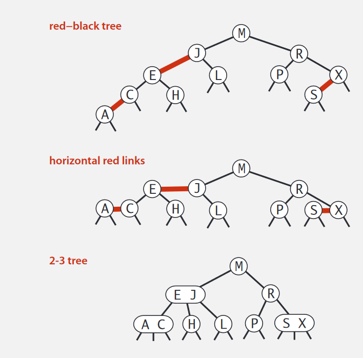

# 查找

---

## 1. hash & 散列表

散列表本质上是对数组的扩展，利用数组能够通过下标在 $O(1)$ 内随机访问元素的特性，在数组的基础上，通过计算，将给定对象的某种标识转换为数组元素的某个下标，实现在 $O(1)$ 内访问元素

**散列函数**：

* 计算结果必须是非负整数
* 如果 ```key1 == key2```，那么 ```hash(key1) == hash(key2)```
* 如果 ```key1 != key2```，那么 ```hash(key1) != hash(key2)```（理想情况）

**hash 冲突**：

在理想的散列函数需要满足的三个条件中，第三个条件，也就是说不同的 key，其得到 hash 值必须也是不同的，但是现实中无法满足这种理想情况，需要解决 hash 冲突的问题：

* **链表法**：能够容忍大的装载因子，由于指针存储会占用空间，更适合存储大对象，支持更多的优化策略如红黑树的转换等
* **开放地址法**：使用连续的内存空间存储元素，对 CPU 缓存加速友好，实现简单，序列化容易，适合转载因子小、数据量小的场合，如 Java 中的 ThreadLocalMap 就是用了这种解决 hash 冲突的方法
* **比较**：开放地址法删除麻烦，而且所有元素装在一个数组中，相比于拉链法，hash 冲突的概率更高，所以装载因子不能过大，因为需要连续的内存空间，所以会更加浪费空间。
* **线性探测法**：开放地址法的一种
  * 插入：发现位置已被占用时就从当前位置依次向后查找
  * 查找：与插入过程类似，当遍历到空位置时说明元素不存在
  * 删除：将删除元素后的位置标记，防止出现空位置导致查找错误

**如何设计一个工业级散列表**：

* 合适的散列函数，太复杂会影响计算效率，hash 值需要尽可能均匀，比如对于字符串，将其看作一个 n 位的 R 进制数来进行计算，令每一个字符都参与进计算
* 合适的装载因子阈值，以及高效的动态扩容策略，复杂的如 JDK8 中 ConcurrentHashMap 的并发扩容，简单的如 Redis 中 Dict 的渐进式 rehash
* 合适的散列冲突的解决方法，使得在极端条件下散列表的性能也不会退化得过于严重

**散列函数的应用**：

* **唯一标识**：在海量图片中检索是否存在与目标图片相同的图片。不能单纯比较元数据，可以对海量图片建立 hash 索引，如使用图片二进制格式的某些位来计算 hash 值，将对应的图片路径存储在散列表中
* **数据分片**：1T 日志记录记录了搜索的关键词，需要统计每个关键词次数。使用 n 台机器并行处理，对待统计的关键词进行 hash 计算，对 n 取模，得到的值是机器的标号，这样就把相同的关键词分配到同一台机器上，也就是对数据进行了分片，最后汇总结果即可
* **分布式缓存**：一致性 hash 算法

## 2. 跳表

跳表就是抽取了多层索引的链表，在链表上实现了类似二分查找的效果。

**查找的时间复杂度**：假设每一层的索引个数是底下一层的 1/2，链表有 n 个节点，则一共有 $log_{2}n-1$ 层索引，整个跳表的高度为 $log_{2}n$，每层遍历 m 个节点，则跳表查找元素的时间复杂度为 $O(m*log_{2}n)$。按照这种索引结构，m 最大为 3，此时时间复杂度与二分查找相同

* 为什么 m 最大为 3？

    

    当按照 1/2 向上抽取索引时，可以看到这种结构下当查找的元素大于第 k 级的 y 时，在第 k-1 级中最多只需要访问 [y,z] 之间的 3 个元素，以此类推，每一级最多访问 3 个索引节点

**空间复杂度**：按照 1/2 抽取上层索引时，$log_{2}n-1$ 层索引共有 $n-2$ 个索引，所以空间复杂度为 $O(n)$

索引层更新：在向跳表插入元素时，**通过随机函数的方式将这个节点同时插入到索引的 1～k 层**，从概率上保证索引和数据的平衡，在删除时如果索引层也存在此节点，需要一并删除。

与红黑树比较：跳表的区间查找效率高于红黑树，实现也比红黑树简单，但是红黑树比跳表出现时间早，而且有较多现成的实现。

## 3. 二叉树

**完全二叉树**：除了最后一层，其他各层满节点，最底层叶子节点靠左。

**满二叉树**：所有叶子节点在最底层，所有非叶子节点都有两个子节点。

二叉树的顺序存储：顺序存储使用数组，当节点在 $i$ 位置时，则有：
  
* 左子节点： $2*i$
* 右子节点： $2*i+1$
* 父节点：$i/2$
* 为了便于计算将根节点存储在下标为 1 的位置

需要注意的是，对于完全二叉树，一组数据能够构建出树的棵数就是这些数在数组中存放的方式，也就是 $n!$ 。

**遍历时间复杂度**：前中后序遍历时每个元素访问两次，时间复杂度为 $O(n)$。

### 3.1 BST

二叉树其实不要求节点有序，而我们通常所说的二叉树一般指二叉查找树（BST）。

特性：

* 中序遍历 BST，可在 $O(n)$ 内输出有序序列
* 对于完全二叉树，高度小于等于 $log_{2}n + 1$
* 对于满二叉树，高度等于 $log_{2}n$
* 查找、插入、删除的时间复杂度和**高度**成正比，而最坏情况下 BST 会退化为链表

### 3.2 支持重复数据的 BST

BST 要求左右子树的所有节点的值分别小于和大于当前节点的值，不允许存在重复数据，如果需要查找时支持重复数据，一般有两种处理手段：

* 将相同 key 的元素存在同一个节点上，通过支持动态扩容的数据或链表来维护
* 将相同的 key 的元素存放在右子树，当查找时遇到 key 相同的节点并不停止查找，而是继续在右子树中查找，直到遇到叶子节点，这样才能查找出所有 key 为目标值元素

## 4. 红黑树

平衡 BST：任意一个节点左右子树高度相差不超过 1。

2-3 树：为了保证树的平衡性，在 BST 的基础上允许一个节点最多保存两个元素。


如图所示，**一棵完美平衡的 2-3 树中根节点到所有空链接的距离是相同的**。

红黑树：将 2-3 树中 3 节点的链接作为红链接，其他链接作为黑链接，就可以得到一棵红黑树。红黑树的另一种等价定义是：

* 红链接为左链接
* 没有一个节点同时和两条红链接相连
* 完美黑色平衡：根节点到所有空链接路径上黑链接数相同



只要将红链接画平，红黑树就是一棵 2-3 树。

特性：

* 不是严格的平衡 BST
* 红黑树既是 2-3 树，又是 BST，所以中序遍历序列仍然有序
* 高度不超过 $2log_{2}n$
* 查找、插入、删除的时间复杂度为 $O(log_{2}n)$

## 4. B+ 树

需要明确的，B+ 树是为磁盘存储专门设计的一种平衡查找树

基本结构：
* 只有叶子节点存储数据（key & value），非叶子节点只存储索引（key）
	* 非叶子节点可以存放更多的索引数据，树的高度更低，降低 I/O 次数
* 所有叶子节点形成有序的双向链表
	* 有利于范围查询且支持排序
* 节点大小固定
	* 索引叶子结点数据物理连续，利用磁盘预读一次读入多个节点到内存，减少 I/O 次数

> B 树的非叶子节点也有数据，叶子结点间不形成链表

### 为什么 InnoDB 不使用其他索引结构

* 散列表：不支持按区间查找
* 其他树：
	* 数据量大时树的高度也会变大，增大 IO 次数
	* 即使能够通过中序遍历得到有序序列，仍然无法快速按区间查找
* 跳表：随机 I/O


> 磁盘预读：即使只需要一个字节，磁盘也会从这个位置开始，顺序向后读取一定长度的数据放入内存，因为局部预读性原理认为：
> 	1. 当计算机访问一个地址的数据的时候，与其相邻的数据也会很快被访问到
> 	2. 程序运行期间所需要的数据通常比较集中

## 5. 位图 & 布隆过滤器

可以认为位图是一种特殊的散列表，使用数组的形式，每个元素大小为 1bit，大范围内进行查找可以这样进行：

* 数组的申请长度为待查找区间长度
* 数组的下标代表了这个数，这个位置上的 bit 代表了这个数是否存在
* 查找时直接访问対应下标元素，通过查看 bit 位可知查找的数字是否存在于区间中

位图的应用：

* 借助全量位图，可以和存储特定元素的位图进行集合运算
* 求交集，如某几段时间的交集，精确到秒，按秒建立位图即可

位图的这种存储形式很明显是为了节约存储空间，但位图的大小直接和待查找区间的长度挂钩，可能存在「给待查找区间中每一个位置分配 1bit 的总大小」大于「所有待查找数据的总大小」，而布隆过滤器就是対这种情况进行的优化。

布隆过滤器在位图的基础上增加了多个 hash 函数，当一个数字需要存储在位图中时，需要将每一个 hash 值和位图大小取模得到的结果存入，当查找时只有当所有位的值都相同才认为这个数能被查找到。这样就可以在不增加位图大小的基础上存储更多的数据。多个 hash 函数则是为了降低 hash 冲突的概率。

需要注意的是这种多个 hash 函数的机制会出现误判情况：不存在的元素经过 hash 后对应的各个 bit 均为 true，也就是说将不存在的元素误判为存在，为了避免误判：

* 增加位图大小或增加 hash 次数
* 维护白名单，存储被误判的 key

注意，如果判断某个数不存在，那么这个数就是不存在的，不会出现误判。
