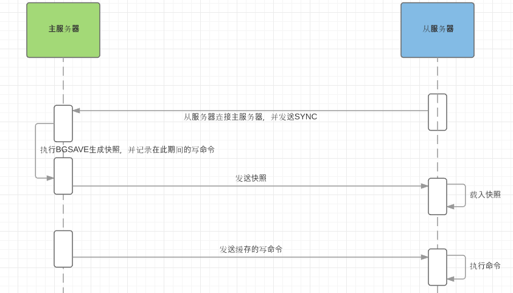

# Redis

---

Redis 是一种非关系型内存数据库，可以用作计数器、缓存 Session、分布式锁、缓存数据等。

与 Memcached 相比，Redis 支持更多的数据类型，能够持久化，支持分布式，数据可以交换到磁盘等。

## 1. 底层数据结构

### 1.1 简单动态字符串（Simple Dynamic String）

使用一个结构体定义，包括一个 char[]、已使用的长度、未使用长度，这种动态的特性便于内存分配以及快速返回字符串长度。

### 1.2 压缩列表

类似于数组，使用一块连续的内存空间。

数组的缺点：数组不同的是，数组存储同类型元素时，单个元素所占内存空间的大小是以要存储元素中最大元素的大小决定的，一旦分配无法更改，这样势必会导致其他元素无法占满被分配的空间，导致浪费。

压缩列表的改进：

* 为每个元素分配的内存不相等，避免了浪费
* 可存储不同类型元素

**如何实现不相等的内存分配**：

zlbytes|zltail|zllen|entry1|entry2|...|entryN|zlend
---|---|---|---|---|---|---|---

* zlbytes：压缩列表占用的字节数
* zltail：最后一个节点 entryN 距离起始地址 zlbytes 的偏移量
* zllen：节点数
* zlend：末尾标记
* entry：持有前一个节点的长度，当前节点首地址减去此长度即可寻址到前一个节点，可实现**倒序遍历**

缺陷：在插入新节点时需要更新此位置后一个节点持有的长度数据，当长度数据的更新导致节点长度变化时，这种现象可能会导致连锁效应，影响性能。

### 1.3 链表

在双向链表的基础上，增加了一个 list 结构，持有双向链表的头尾指针，并维护如长度等信息，便于使用。

### 1.4 散列表

Redis 中的散列表采用了渐进式 rehash，当数据量比较大时，会申请另一个散列表，在 rehash 期间，每次进行 CRUD 操作时都会将当前散列表中的一个元素 rehash 到新的散列表中。

### 1.5 跳表

Redis 中的跳表由存放数据的 zskiplistNode 和 zskiplist 构成：

* zskiplistNode 中维护了 level 属性，表示索引层级，每层维护了指向当前层下一个索引节点的指针以及前进的跨度；拥有前向指针，并持有一个 score 属性，保存此节点数据的分值，所有数据节点按分值从小到大排列
* zskiplist 类似于双向链表中的 list 结构，持有跳表的头尾指针、索引层数、节点个数等信息

为什么 Redis 没有选择红黑树或者 B+ 树来代替跳表？

* 一方面是跳表实现更简单，而且根据各索引层节点抽取的个数不同，指针占用的空间也更灵活，由于 Redis 是内存数据库，所以在内存占用方面需要尽可能优化
* 另一方面是在并发情况下如果需要更新数据，不论是红黑树还是 B+ 树，平衡的过程需要牵扯到较多的节点，所以加锁的时间较长，相比之下跳表更新数据时更新的节点数就少很多

## 2. 基本数据类型

**string**：可存储字符串、数字等，能够对数字进行原子性的自增减

* 计数器
* 分布式锁
* 分布式 session
* 分布式 id

**list**：能够从两端压入或弹出元素，底层为压缩列表或链表

* 消息队列：社交 APP 的消息列表
* 分页：lrange 命令

**hash**：存储键值对，底层为压缩列表或散列表

* 存储结构化数据

**set**：无序集合，不重复，判断指定元素是否在集合中、进行集合运算，底层为数组或散列表

* 点赞
* 好友关系
* 商品筛选：建立多个标签 set，进行集合运算即可
* 全局去重

**zset**：有序集合，根据分值查找、计算排名、范围查找，底层为压缩列表或跳表

* 排行榜

## 3. 线程模型

Redis使用的是单线程工作模型：

* 纯内存操作
* 单线程避免了上下文切换
* 非阻塞的多路复用 IO

不同的操作在 redis-client 中会产生不同事件类型的 socket，服务端采用单线程的 Reactor 模式根据事件类型进行分发。

## 4. 过期策略 & 淘汰机制

Redis 采用「定期删除 + 惰性删除」的过期策略。为了避免性能浪费，Redis 定期随机抽取 key 进行检查，这样会导致很多过期的 key 未被删除，所以在获取某个 key 时再次检查是否过期。这样还会存在失效的 key，积压在内存中，此时就需要内存淘汰机制来将某些数据删除：

* noeviction：内存不足时写入数据报错
* allkeys-lru：删除最近最少使用的 key
* allkeys-random：随机删除某个 key
* volatile-lru：在设置了过期时间的 key 中删除最近最少使用的
* volatile-random：在设置了过期时间的 key 中随机删除一个
* volatile-ttl：在设置了过期时间的 key 中删除将要过期的

## 5. 持久化

||RDB|AOF|
|---|---|---|
|形式|使用快照，将内存数据的二进制序列化|借助日志记录対内存数据进行修改的指令|
|机制|主进程 fork 出子进程，由子进程生成 RDB 文件；fork 期间主进程阻塞，fork 完毕主进程继续响应命令|所有写入命令追加到 AOF 缓冲区，根据策略向磁盘同步；需要定期対 AOF 日志进程重写，防止文件过大|
|优势|快照可复制，比 AOF 恢复快|文件内容清晰易懂，可用性更高，可以设置每秒同步甚至每修改同步|
|缺陷|数据量很大时创建快照时间过长，导致阻塞；可用性不如 AOF，定时使用快照持久化，宕机前会丢失一部分数据|长期运行过程中 AOF 文件会变得十分庞大，恢复时相应地也会更慢|

混合持久化：Redis 4.0 引入了混合持久化，RDB 数据位于 AOF 文件的开头，储存开始执行持久化时的数据状态；持久化期间发生的修改由 AOF 形式记录。

## 6. 缓存问题

**缓存穿透**：故意请求缓存中不存在的数据，导致所有请求涌向数据库。

* 缓存空值：将不存在的数据缓存为空值，并设置一个很短的有效期，防止占用空间，但如果有效期内这些 key 的数据被写入数据库，则会导致不一致问题。
* 布隆过滤器：使用所有的 key 建立一个 Bloom Filter，从而快速判断请求的 key 是否合法。

**缓存雪崩**：缓存设置了相同的过期，同一时间缓存大面积失效。

* 随机值：给失效时间加一个随机值，避免集体失效
* 双缓存：主节点设置短期失效时间，从节点设置长期失效时间，读缓存时主缓存没有就从从缓存中读，并同时更新主从缓存

**缓存击穿**：热点数据过期，导致大量请求涌向数据库。

* 双缓存
* [分布式锁](../../Web/distribution/distribution.md#redis_lock)

## 7. 高可用配置

### 7.1 主从模式

主从节点数据一致，从节点用来扩展读能力，使用主从复制的方式来进行数据同步：

* 全量同步：

    

    主节点在生成完毕快照后会开始将新接收的写命令缓存，发送完毕快照后再发送缓存的写命令
* 增量同步：主节点每执行一个写命令就向从节点发送相同的命令

### 7.2 哨兵模式

哨兵模式是在主从模式的基础上额外添加**一组**用于监控的 Redis 实例，用于在主节点发生故障时进行**故障发现**和**故障转移**。

故障发现：

1. 哨兵节点会向主节点发送心跳包，哨兵节点之间也会发送心跳包
2. 一定时间内收不到主节点的心跳包责该哨兵认为主节点下线
3. 该哨兵询问其他哨兵，如果收到超过指定数目的哨兵回复主节点下线，则认为主节点故障，开始进行故障转移

故障转移：

1. 通过选举算法（Raft）选出领导者哨兵进行故障转移
2. 选取从节点将其升级为主节点：
    * 过滤掉已下线、没有回复过心跳包的从节点
    * 选取优先级高、内容最完整的
3. 其他从节点变为新主节点的从节点，通知客户端主节点更换，旧主节点恢复则称为从节点

### 7.3 集群模式

哨兵模式无法解决从节点下线的故障转移，集群模式借助 hash slot 实现分布式存储，使用 bitmap 维护节点和 slot 的对应关系，bitmap 通过 Gossip 协议在各个节点中传递。
