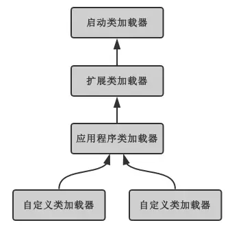
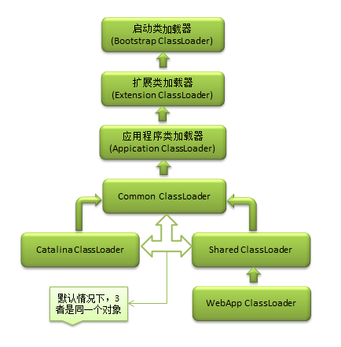

# 类与实例

---

## 1. 类加载过程

首先需要明确的是，**类加载就是把 class 文件加载到内存，经过校验、解析、初始化等，产生 JVM 能够直接使用的类，并于堆中生成这个类的 Class 对象**。它封装了类在方法区的数据，并且向外提供访问这个对象的接口。

### 1.1 加载

场景：JVM 规范中没有强制约束类加载中加载阶段的触发时机，由具体实现自行把握。我们能够得知的是加载阶段一定是在初始化之前被触发。

作用：

* 获取类 class 文件的二进制字节流
* 将字节流代表的静态存储结构转换为方法区中的运行时动态数据结构
* 生成该类的 Class 对象，作为访问该类在方法区中各种数据的入口

需要明确的是，获取 class 文件的二进制字节流时，并没有明确指出获取的方式，也就是说即使在运行也可以将 Java 源文件编译为 class 文件并加载。

### 1.2 连接

**验证**：保证 Class 文件的字节流的信息符合 JVM 要求，并不会危害到 JVM 的自身安全。

**准备**：为**类变量**（静态变量）在**方法区**中分配内存，并设置变量初始值为该数据类型的零值，需要注意的是：

* final 修饰的类变量会在方法区中直接被初始化为指定的值
* 实例变量不会在此阶段被初始化，而是在实例化对象时随对象一起分配在堆中

**[解析](#resolve)**：将常量池中的符号引用替换为直接引用。

* 符号引用：用特定符号描述引用目标，可以是任何形式的字面量，由 JVM 规范定义。

  > 使用 javap 反编译 class 文件可以查看符号引用。

* 直接引用：用于对已存在于内存中的目标的定位，可以是指针、偏移量等。

### 1.3 初始化

此阶段才会真正开始执行类中的 Java 初始化代码，主要目的是初始化类变量，对类变量初始化的方式有两种：

* 声明时直接指定
* 静态代码块

初始化步骤：

1. 保证类已经加载和连接
2. 保证父类已经初始化
3. 依次执行类中的初始化语句，也就是类构造器 \<clinit> 的执行过程

关于类构造器 \<clinit>：

* 由编译器自动收集类中所有类变量的赋值语句及静态代码块中的语句合并产生，其顺序由语句出现的顺序决定。这也导致了**静态代码块中只能访问其之前定义的静态变量，对于其后定义的只能赋值不能访问**。这里的访问指的是对变量进行引用，如参与表达式运算、使用这个变量为其他变量赋值等，都是不允许的，这是为了保证一个变量在使用之前已经被正确地初始化
* 与 \<init> 不同，子类不需要显式调用父类的类构造器，JVM 会保证子类 \<clinit> 执行前父类的一定执行完毕，因此 JVM 中第一个执行 \<clinit> 的类一定是 Object
* JVM 会保证多线程下同一个类的 \<clinit> 被同步执行

#### 1.3.1 初始化场景

JVM 中规定了需要立即对类进行初始化的场景，称为对类的主动引用：

* 遇到 new、getstatic、putstatic、invokestatic 这四条字节码指令，常见的场景是：new、访问非 final 静态属性、访问静态方法
* 反射
* 初始化子类时若父类还没有初始化，会先初始化父类
* 被 JVM 标明为启动类，如包含 main() 的类

被动引用不会触发初始化:

* 定义对象数组
* 通过子类引用父类的静态属性不会引起子类的初始化：因为引用静态属性只会引起直接定义它的类的初始化
* 访问 final 修饰的静态属性（**限定为常量**，如 int、String，对象和包装类都不属于）时不会引起定义它的类的初始化：因为这个变量在编译期间会存入调用它的类的常量池中，相当于并没有引用定义这个变量的类

#### 1.3.2 初始化顺序

* 按照字段声明的顺序初始化
* 访问子类静态成员 (属性 / 方法) 会引起父类初始化
* 静态字段在非静态字段之前被初始化

## 2. 类加载器

首先需要明确的是，类加载器的作用就是完成「获取类 class 文件的二进制字节流」这个动作，其次类加载器和类一起确定这个类在 JVM 中的唯一性。

类型：

* 启动类加载器（Bootstrap ClassLoader）：加载 <JAVA_HOME>/lib/ 或参数指定路径下被 JVM 能够识别的类，无法被 Java 程序引用
* 扩展类加载器（Extension ClassLoader）：加载 <JAVA_HOME>/lib/ext/ 或系统变量指定路径下的类库，可直接使用
* 应用程序类加载器（Application ClassLoader）：加载 CLASSPATH 下指定路径的类库

关于 jar 包的加载：

* 与类加载器有关，层级越高的类加载器越优先加载其加载路径下的 jar 包
* 与文件系统有关，这会影响类加载器加载路径中获取到的 jar 包顺序，从而影响加载顺序

### 2.1 双亲委托模型



如果一个类加载器收到了加载请求，它不会自己尝试加载这个类，而是将请求委托给上级加载器，因此所有的加载请求都会到达启动类加载器中，只有当父类加载器无法完成加载，也就是**它的搜索范围中无法找到这个类**时，子类加载器才会尝试加载，这样设计的优点是：

* Java 的类随着它的加载器具备了一种层级关系，越基础的类由越上层的加载器加载。如 Object，无论哪个 ClassLoader 加载，最终都会交由 Bootstrap ClassLoader 加载。这样即使自行编写了 Object，双亲委托机制也会保证 Object 的加载请求一定会到达 Bootstrap ClassLoader，而 Bootstrap ClassLoader 搜索到的 Object 一定是属于 JDK 的，自己编写的 Object 永远无法被加载
* 加载 JDK 中不同路径下的文件，用来区分 JDK 层级结构，在这方面 Tomcat 的类加载器体现得较为明显

### 2.2 破坏双亲委托模型

因为双亲委托模型的缘故，越是基础的类越是由上层加载器加载，所以当被上层加载的基础类需要调用用户实现的类，就需要打破双亲委托。

引入线程上下文加载器（Thread Context ClassLoader）去加载双亲模型下无法加载的类：

* 可以通过 Thread 设置
* 如果未设置就继承父线程的，如果父线程也未设置则默认为 Application ClassLoader

### 2.3 Tomcat 类加载机制

Web 容器的基本功能：

* 同一个容器中不同 Web 应用的不同第三方类库相互隔离
* 同一个容器中不同 Web 应用的相同第三方类库可以共享
* Web 容器的类库与 Web 应用的类库隔离



目录：

* common：类库可被 Tomcat 和所有 Web 应用程序共同使用
* server：类库可被 Tomcat 使用，但对所有 Web 应用程序都不可见
* shared：类库可被所有 Web 应用程序共同使用，但对 Tomcat 不可见
* WebApp / WEB-INF：类库仅仅可以被此 Web 应用程序使用，对 Tomcat 和其他 Web 应用程序都不可见

需要注意的是，默认使用 CommonClassLoader 来代替 CatalinaClassLoader 和SharedClassLoader，所以 Tomcat 6.x 以上将上述三个目录合并成了一个 lib 目录

加载器：

* 下级类加载器能够使用上级加载器加载的类
* CatalinaClassLoader 和 SharedClassLoader 各自加载的类则与对方的相互隔离
* 各个 WebAppClassLoader 实例之间相互隔离

### 2.4 Spring 的加载

如果有多个 Web 应用程序用到 Spring，可以把 Spring 的 jar 包放到 shared 目录下让这些程序共享，SharedClassLoader 会加载 Spring：

* Spring 会管理每个应用程序的 bean，而用户的程序显然是放在 WebApp / WEB-INF 目录中，由 WebAppClassLoader 加载，SharedClassLoader 无法加载

Spring 根本不会去管自己所处的位置，统统使用 TCCL 来加载类，将 TCCL 设置为 WebAppClassLoader。也就是说哪个 Web 应用使用 Spring，Spring 就去获取加载这个 Web 应用的 WebAppClassLoader 来加载 bean。

## 3. 实例化

通过 new 实例化对象就是通过 Class 对象来创建该类的对象，只是这个过程对于我们是透明的而已。

### 3.1 实例化过程

1. 进行类加载检查
2. 在堆中分配内存空间
3. 实例字段零值初始化，为了保证在代码中不进行初始化也能够进行使用
4. 对象头信息设置，如 hash 码、是否启用偏向锁等
5. 执行实例对象构造器 \<init>

内存分配方法：

* 指针碰撞：假设堆内存中的空闲空间是规整的，使用与未使用的空间全部为连续，则将只需将指针移动与对象大小相等的距离即可
* 空闲列表：针对堆内存中的空间零散分布时，虚拟机维护着一个列表，记录空间的可用性，需要注意的是，内存空间的规整与否由垃圾回收器决定

内存分配并发安全：

* CAS
* 每个线程预先分配一小块内存，称为本地线程分配缓冲 (Thread Local Allocation Buffer)，把分配内存的动作按照线程划分，当 TLAB 用完并分配新的 TLAB 时加锁

### 3.2 实例化顺序

* 与初始化类似，构造代码块中只能访问其之前声明的变量，对于之后声明的变量只能进行赋值
* 与初始化类似，实例构造器 \<init> 也是按照出现的顺序来收集赋值语句和构造代码块
* 与初始化不同的时，如果父类未实例化，执行子类的 \<init> 前需要先执行父类的 \<init>，这是因为需要保证子类实例的完整性
* 实例构造器 \<init> 在构造方法之前执行

综上，初始化和实例化的顺序为：

1. 父类 \<clinit>
2. 子类 \<clinit>
3. 父类 \<init>
4. 父类构造方法
5. 子类 \<init>
6. 子类构造方法

```java
class Foo {
    int i = 1;

    Foo() {
        System.out.println(i);
        int x = getValue();
        System.out.println(x);
    }

    {
        i = 2;
    }

    protected int getValue() {
        return i;
    }
}

//子类
class Bar extends Foo {
    int j = 1;

    Bar() {
        j = 2;
    }

    {
        j = 3;
    }

    @Override
    protected int getValue() {
        return j;
    }
}

public class Test {
    public static void main(String... args) {
        Foo foo = new Foo();// 2 2
        Bar bar = new Bar();// 2 0
        // 需要注意这里的 0，当子类引起父类实例化时父类调用的 getValue() 实际上已经是子类重写的方法
        // 而此时子类还未实例化，但已经被初始化，所以 j 为 0
        // 当单独实例化父类时则构造方法于 <init> 后执行，所以 i 为 2
    }
}
```

需要注意的是，实例化并不是必须在初始化完成后才能进行：

```java
public class StaticTest {
    public static void main(String[] args) {
        staticFunction();
    }

    static StaticTest st = new StaticTest();

    static {
        System.out.println("1");
    }

    {
        System.out.println("2");
    }

    StaticTest() {
        System.out.println("3");
        System.out.println("a=" + a + ",b=" + b);
    }

    public static void staticFunction() {
        System.out.println("4");
    }

    int a = 110;    // 实例变量
    static int b = 112;     // 静态变量
}
// 2
// 3
// a=110,b=0
// 1
// 4
```

1. 访问静态方法触发类加载
2. 在准备阶段类变量 st、b 被赋值 null、0
3. 在初始化阶段按照顺序首先对 st 初始化，引起了实例化从而执行 \<init> 和构造方法
4. 对 b 初始化
5. 执行静态方法

## 4. 类的卸载

类的卸载需要满足以下三个条件：

* 所有的实例都已经被 GC
* 加载该类的 ClassLoader 已经被 GC
* 任何地方都不再引用类的 Class 对象

如果以上三个条件全部满足，JVM 就会清空这个类在方法区的信息，类的整个生命周期就结束了。

需要注意的是，JVM 自带的类加载器所加载的类，在 JVM 的生命周期中始终不会被卸载，这些类加载器会始终引用它们所加载的类的 Class 对象。
