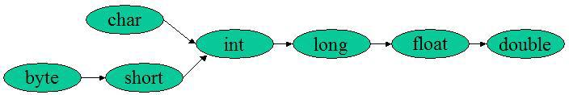

# 语法基础

---

## 1. 基本数据类型

* byte：8bit
* short：2byte
* int / float：4byte
* long / double：8byte
* char：2byte，Java 使用 Unicode 编码，无论中文或英文字符均可使用 1 个char 存储
* boolean：表达式中的 boolean 在编译后会使用 int 类型代替，因为对于当下的 32 位处理器来说使用 int 类型有高速存取的特点；而 boolean 数组则会被编码为 byte 数组，节省空间

需要注意的是，**Java 默认是有符号数**，所以如 byte 的范围就是 [-128, 127]，而不是 [0, 255]。

## 2. 基本数据类型转换

* Java 要求参与运算的数据类型必须一致：所以 JVM 会进行自动类型转换（隐式向上转型）
  * 表达式类型与表达式中最高级操作数类型相同
  * `+` `-` `*` `/` `%` 和 `=` 的结合运算及自增自减会进行自动类型转换



* Java 不允许隐式向下转型：数字 `1.1` 字面量属于 double 类型，无法直接赋值给 float；同理，数字 `1` 属于 int 字面量，不能赋值给 short。如果需要，必须进行强制类型转换

## 3. 方法

重载：

* 重载可提高代码阅读性
* 重载属于方法签名的改变，方法签名由**参数类型、个数、顺序**组成，异常声明、返回值、同步标记都不属于方法签名
* 同一个类中才能重载

## 4. 异常

在进行异常转换时将内部异常传入转换后的异常，抛出时会有```Caused by:Xxx```信息，这个信息表示的捕获到的最原始的异常

异常屏蔽：当 finally 中抛出异常时，catch 中待抛出的异常会被屏蔽 (Suppressed)，在 finally 中使用```e.addSuppressed(originException)```即可

finally & return

```java
public class TestTryCatchFinally {

    // 2
    private static int test1() {
        int x = 0;
        try {
            ++x;
            return ++x;
        } catch (Exception e) {
            ++x;
            return ++x;
        } finally {
            ++x;
        }
    }
    // 4
    private static int test2() {
        int x = 0;
        try {
            ++x;
            return ++x;
        } catch (Exception e) {
            ++x;
            return ++x;
        } finally {
            ++x;
            return ++x;
        }
    }
    // 3
    private static int test3() {
        int x = 0;
        try {
            ++x;
            Integer.parseInt(null);
            return ++x;
        } catch (Exception e) {
            ++x;
            return ++x;
        } finally {
            ++x;
        }
    }
    // 5
    private static int test4() {
        int x = 0;
        try {
            ++x;
            Integer.parseInt(null);
            return ++x;
        } catch (Exception e) {
            ++x;
            return ++x;
        } finally {
            ++x;
            return ++x;
        }
    }
    // exception
    private static int test5() {
        int x = 0;
        try {
            ++x;
            Integer.parseInt(null);
            return ++x;
        } catch (Exception e) {
            ++x;
            Integer.parseInt(null);
            return ++x;
        } finally {
            ++x;
        }
    }
    // 4
    private static int test6() {
        int x = 0;
        try {
            ++x;
            Integer.parseInt(null);
            return ++x;
        } catch (Exception e) {
            ++x;
            Integer.parseInt(null);
            return ++x;
        } finally {
            ++x;
            return ++x;
        }
    }
    // exception
    private static int test7() {
        int x = 0;
        try {
            ++x;
            Integer.parseInt(null);
            return ++x;
        } catch (NullPointerException e) {
            ++x;
            return ++x;
        } finally {
            ++x;
        }
    }
    // 3
    private static int test8() {
        int x = 0;
        try {
            ++x;
            Integer.parseInt(null);
            return ++x;
        } catch (NullPointerException e) {
            ++x;
            return ++x;
        } finally {
            ++x;
            return ++x;
        }
    }
    // exception
    private static int test9() {
        int x = 0;
        try {
            ++x;
            return ++x;
        } catch (Exception e) {
            ++x;
            return ++x;
        } finally {
            ++x;
            String.valueOf(null);
            return ++x;
        }
    }
}
```
