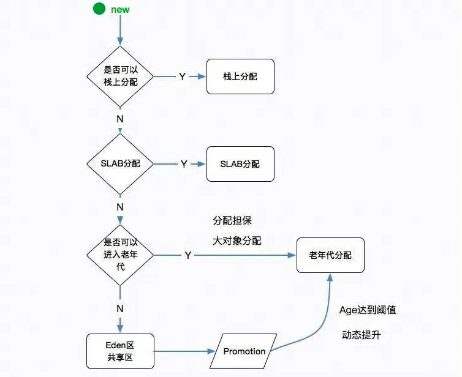

# JVM

## 运行时区域

* 程序计数器：线程私有，存放下一条指令的位置
* 虚拟机栈：线程私有，生命周期与线程相同，用来描述方法执行的模型
    * 栈的深度大于 JVM 允许值会抛出 StackOverFlowError
    * 申请栈时无法申请到足够的内存会抛出 OutOfMemoryError
* 本地方法栈：与栈类似，用来执行 native 方法
* 堆：线程共享，用来存放对象实例，也是 GC 的主要区域
    * 开启逃逸分析后，某些未逃逸的对象会分配在栈中
* 元空间：线程共享，存储已经被 JVM 加载的类的相关信息，如类对象、常量池
    * 当 java 类过多，如 Spring 生成了太多代理类，可能会发生与元空间溢出

> 分区的意义在于针对不同类型的数据抽象出不同的区域以便于管理

## 内存分配机制

### 堆上内存分配的线程安全问题

* CAS：当堆内存没有被其他线程操作时当前线程才会进行对象的分配
* TLAB：在 TLAB 机制启动时，线程初始化时 JVM 会为其在堆中分配一块专属内存
    * 线程需要分配内存时就在这块专属区域进行
    * TLAB 的分配过程是需要并发控制的，如果 TLAB 剩余空间不够对象分配，则也可能导致 TLAB 被频繁分配。所以 JVM 存在此机制：TLAB 空间不够且请求分配的内存大于某值时，会直接在堆中分配，否则再分配一块 TLAB

### 对象的 promotion

对象可能会晋升到老年代：
* age 达到阈值：躲过一定次数 YoungGC
* 动态提升：如果 Survivor 中小于等于某个 age 到对象达到了 Survivor 空间的一半，则将大于此 age 的对象 promotion 到老年代
* 大对象分配：大于某值的对象直接在老年代分配

### 空间分配担保

YoungGC 后可能存在剩余对象空间大于一个 survivor 区的情况，此时就需要将对象移动到老年代，为了避免老年代空间也不足的情况，YoungGC 前需要进行空间分配担保：
* YoungGC 前会检查老年代最大连续空间是否大于年轻代所有对象大小总和
    * 如果大于则可以进行 YoungGC
    * 如果小于则检查老年代最大连续空间是否大于历次 YoungGC 后晋升到老年代对象的平均大小
    * 如果仍然大于就会触发 FullGC

### GC 时机

* YoungGC：Eden 区满
* FullGC：
    * 老年代满
    * 元空间不足
    * 空间担保分配失败

### 对象创建的步骤

1. 类加载检查：检查类是否被加载过，如果没有需要先执行类加载
2. 分配内存：
    * 指针碰撞：堆内存中的空闲空间是连续的时则将只需将指针移动与对象大小相等的距离即可
    * 空闲列表：堆内存中的空闲空间零散分布时，虚拟机维护着一个列表，记录空间的可用性
3. 初始化零值：保证对象不进行初始化也可以使用
4. 设置对象头：如对象是哪个类的实例、GC 分代年龄等
5. 执行 init：编译器将赋值语句、构造块、构造方法等逻辑收敛到 init 中并执行

## GC

### 对象引用类型

* 强引用：即使内存不足也不会被 GC
* 弱引用：下一次就会被 GC
* 软引用：内存不足时才会被 GC
* 虚引用：主要用来跟踪对象被 GC 的活动

### 对象存活判定

* 引用计数：给对象添加计数器，多一个引用加 1，失效一个引用则减 1
    * 优点：实现简单，判定快
    * 缺点：无法解决循环引用
* 可达性分析：通过 GC Roots 对象作为起点，搜过通过引用可以达到的对象，剩下不可到达的对象即可被 GC
    * GC Roots：一定存活的对象，如 Thread 对象，局部变量、系统类加载器加载的对象等
    * 缺点：
        * 整个过程需要 STW
        * 需要记录对象引用关系，占用内存空间大
* 三色标记：解决了循环引用和 STW 长的问题

### GC 算法

* 标记-清除：
    * 优点：不需要移动对象，速度快
    * 缺点：产生内存碎片
* 标记-复制：将内存分为两部分，每次使用一块，空间满后将存活的对象复制到另一块区域去
    * 优点：实现简单、效率高、不产生内存碎片
    * 缺点：空间利用率低，复制对象有性能消耗
* 标记-整理：
    * 优点：不产生内存碎片，空间利用率高
    * 缺点：太耗费性能

> 年轻代对标记-复制算法的应用：
> 1. 先在 Eden 区分配，满了后触发 YoungGC，将剩余对象移动到一个 Survivor 区，清空 Eden 区
> 2. Eden 区满后触发 YoungGC，将 Eden 区 + Survivor 区剩余对象移动至另一个 Survivor 区，清空其他区
这样实现提高了空间利用率

## 垃圾回收器

### G1

#### 改进

相比于 CMS，两个最突出的改进：
* 标记-整理 + 标记-复制，不产生内存碎片
    * 保留 Eden、Survivor、Old 的基础上将整个 heap 区划分为若干个 Region
    * Region 之间使用标记-复制
    * 全局上看 Region 在复制时能够复制到已连续使用 Region 的下一个位置，即标记-整理
* 可预测的 STW：通过记录每个 Region 的 GC 时间以及 GC 后获得的空间，维护一个优先列表，根据指定的 GC 时间，优先回收价值最大的 Region，保证优先时间内获得尽可能高的回收效率

#### GC 过程

1. 初始标记：STW，单线程标记与 GC Roots 直接关联的对象
2. 并发标记：非 STW，单线程进行可达性分析，与用户线程并发
3. 最终标记：STW，多线程再次标记上一阶段中变动的对象
4. GC：STW，多线程执行