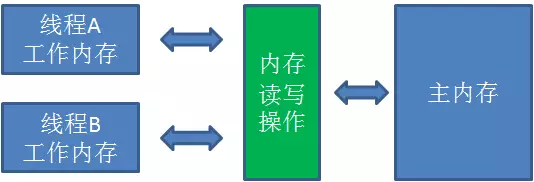

# 定义

JMM 是 JVM 定义的一种规范，不同的 JVM 实现会有差异，主要目标是定义 JVM 在并发下将变量存入内存和从内存中取出的底层细节，这里的变量不包括局部变量和方法参数，因为它们是线程私有的。



* 所有的变量存储在在主内存中
* 工作内存为线程私有的，包含使用到主内存中变量的副本
* 线程对变量的所有操作都只能在自己的工作内存中进行
* 变量的传递必须经过主内存，这些传递操作由 JMM 定义，也就是说 **JMM 控制了 Java 的线程间通信**

# 实现

## 原语
### volatile

**可见性**：当某个线程修改了这个变量的值，会立刻写入主内存，其他线程在获取该值时会判断值是否失效，若失效则从主内存获取新的值。也就是说，**volatile 变量的值在各个线程中是一致的**。一个典型的应用如下:

```java
// 两个线程奇偶交替打印 0-100
// 令打印偶数的线程先开始
// volatile 保证了 flag 被更新后可以立即被另一个线程读取
// flag 使得两个线程 if 内的代码总是互斥的，线程不会发生阻塞
private volatile boolean flag = true;
private static final int total = 100;
private int num = 0;

public static void main(String[] args) {

    Thread t1 = new Thread(() -> {
        while (num <= total - 1) {
            if (!flag) {
                    System.out.println(Thread.currentThread().getName() + ":" + num);
                    num++;
                    flag = true;
            }
        }
    });

    Thread t2 = new Thread(() -> {
        while (num <= total) {
            if (flag) {
                    System.out.println(Thread.currentThread().getName() + ":" + num);
                    num++;
                    flag = false;
            }
        }
    });

    t1.start();
    t2.start();
}
```

**[有序性](#ordered)**：对于普通变量只能保证在依赖这个值的地方能够获取到正确的值，但赋值的顺序与代码中的赋值顺序不一定相同，这是因为 JVM 优化而作出的指令重排序，而 volatile 的有序性则可以一定程度上避免这种情况发生，一个典型的应用如下：

```java
public class Singleton {

    private static volatile Singleton singleton;

    private Singleton() {}

    public static Singleton getInstance() {
        if (singleton == null) {
            synchronized (Singleton.class) {
                if (singleton == null) {
                    //防止指令重排
                    singleton = new Singleton();
                }
            }
        }
        return singleton;
    }
}
```

```singleton = new Singleton()```的执行**不是原子性的**，可以认为分三步：

1. 分配内存空间
2. 初始化对象
3. 将 singleton 指向初始化完成的内存地址

指令重排序可能导致第三步在第二步之前执行，从而导致某个线程拿到的是未初始化的对象，volatile 可以避免这种情况的发生。

### synchronized

synchronized 能够同时保证原子性、可见性和有序性：

* 原子性：JMM 定义的变量在工作内存和主内存间传递的八种操作中，lock 和 unlock 能够提供大范围的原子性，这两个操作由字节码指令 moniterenter 和 moniterexit 提供，而这两条字节码指令反映在 Java 中就是 synchronized 关键字
* 可见性：JMM 在定义八种操作的基础上还定义了一些规则，其中要求「対一个变量执行 unlock 前必须先把此变量同步到主内存中」，所以在 synchronized 块结束时其他线程就能够获取到新的值
* 有序性：由规则「一个变量在同一时刻只允许一条线程对其进行 lock 操作」决定，持有同一个锁（变量）的两个同步块只能串行执行

### final

final 能够保证可见性，因为它令变量只读，并且它会禁止指令重排序，保证对象的安全初始化，防止对象的引用被其他线程在对象被构造完毕前获取到。

## 规则
### happens-before

「先行发生」原则是用来判断线程是否存在竞争、是否安全的主要依据，它是主内存和工作内存间交互操作的规则和关于 volatile 一些规定的**等效判断**：

* 程序次序规则：单个线程内，在前的代码先于在后的代码执行。
* 管程锁定规则：对于同一个锁，unlock 在时间上先于后边的 lock 操作。
* volatile 变量规则：在时间上写操作先发生于读操作。
* 线程启动规则：start() 先发生于线程的其他动作。
* 线程终止规则：线程中所有操作都先发生于对此线程的终止检测。
* 线程中端规则：interrupt() 先发生于被中断的线程内的代码检测到中断事件发生。
* 对象终结规则：对象的初始化（构造方法）结束先发生于 finalize() 方法开始。
* 传递性规则：A 先发生于 B，B 先发生于 C，则 A 先发生于 C。

需要注意的是，**时间上代码的执行顺序与先行发生原则间没有关系**，判断并发安全时以先行发生原则为准。
