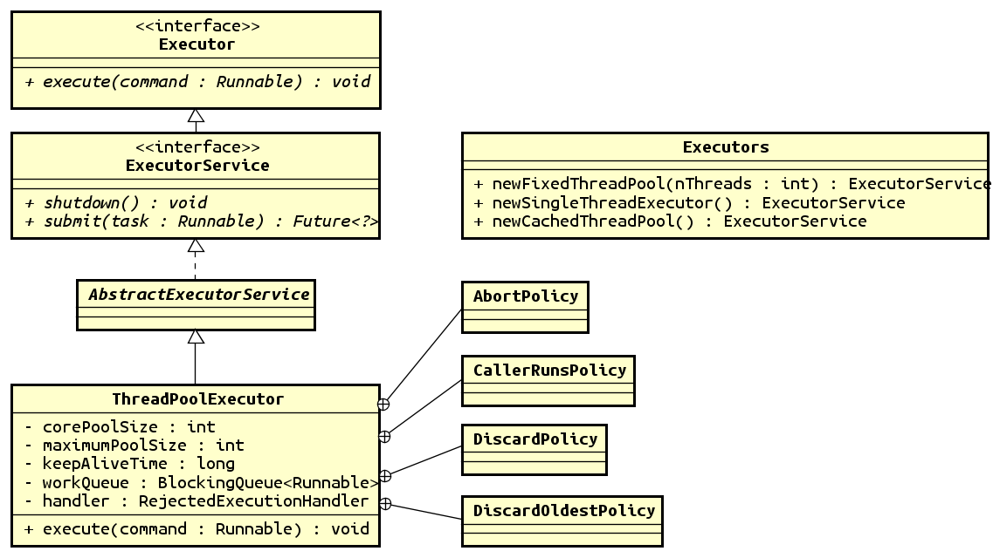
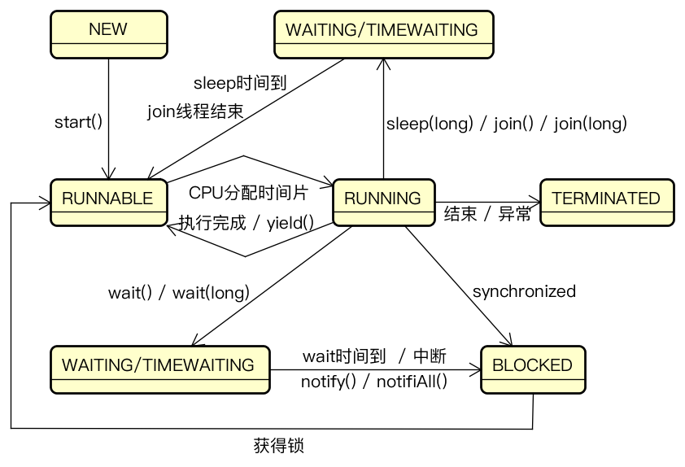

# 线程

---

## 1. 线程的实现

Java 中 Thread 类中的关键方法均为 native 方法，说明 Java 底层对线程的实现是平台相关的，借助操作系统的线程实现，Java 提供的是不同平台下对线程的统一处理。Windows 与 Linux 使用的是一对一模型实现线程，JVM 中直接使用了这种方式。

## 2. 线程池



线程池状态：

* RUNNING：线程池被创建后处于此状态
* SHUTDOWN：调用 shutDown() 后，此时线程池不能接受新任务，但会等待所有任务执行完毕
* STOP：调用 shutDownNow() 后，此时线程池不能接受新的任务，并尝试中断正在执行的任务，清空任务队列，返回尚未执行的任务
* TERMINATED：线程池处于 SHUTDOWN / STOP 并且所有工作线程已经销毁，任务缓存队列已经清空或执行结束

**任务执行机制**：

* 当前线程数目小于 corePoolSize 时，每来一个任务就会创建一个线程执行任务
* 当前线程数目大于等于 corePoolSize 时，每来一个任务则会尝试将其添加到任务队列中
  * 若添加成功，则会等待空闲线程将其取出并执行
  * 若添加失败，则会尝试创建新的线程去执行任务
* 对于空闲时间超过 keepAliveTime 的线程将会被中止，直至池中线程数目不大于 corePoolSize
* 当前线程数达到 maximumPoolSize 时则会采取任务拒绝策略进行处理

**工作队列**：

* 无界队列：如 LinkedBlockingQueue 默认容量是最大的 int 值，这样池中的线程数目永远不会达到 maximumPoolSize，适用于每个任务独立互不影响的情况，但需要注意任务提交速度，防止过度积压占用内存
* 有界队列：如 ArrayBlockingQueue，当队列满后，后续提交的任务根据拒绝策略处理
* 同步移交队列：如 SynchronousQueue，默认工作队列，底层没有链表或数组，也就是说没有存储空间，一旦有任务到达，没有线程处理就会阻塞，所以  maximumPoolSize 会设置得较大；同时，没有额外的数据结构使得性能比其他队列要好

拒绝策略：

* AbortPolicy：默认策略，拒绝新提交的任务，并抛出异常
* CallerRunsPolicy：令提交任务的线程执行任务，不向线程池中添加
* DiscardPolicy：丢弃任务
* DiscardOldestPolicy：丢弃最旧的未处理任务

**创建线程池**：

```java
ExecutorService service = new ThreadPoolExecutor(args)
```

args：

* corePoolSize：核心线程数
* maximumPoolSize：最大线程数
* keepAliveTime：空闲时间
* unit：空闲时间单位
* workQueue：工作队列
* threadFactory：线程工厂，用来设置线程池中线程的一些属性
* handler：拒绝策略

**预定义线程池**：
  
```java
public static ExecutorService newFixedThreadPool(int nThreads) {
    return new ThreadPoolExecutor(nThreads, nThreads,
                                    0L, TimeUnit.MILLISECONDS,
                                    new LinkedBlockingQueue<Runnable>());
}
```

固定数量的线程 + 无界队列

```java
public static ExecutorService newSingleThreadExecutor() {
    return new FinalizableDelegatedExecutorService
        (new ThreadPoolExecutor(1, 1,
                                0L, TimeUnit.MILLISECONDS,
                                new LinkedBlockingQueue<Runnable>()));
}
```

只能使用 1 个线程，顺序执行

```java
public static ExecutorService newCachedThreadPool() {
    return new ThreadPoolExecutor(0, Integer.MAX_VALUE,
                                    60L, TimeUnit.SECONDS,
                                    new SynchronousQueue<Runnable>());
}
```

任务到达就立即执行，线程数可以无限扩大

线程数量设置：

* CPU 密集型程序：增加线程不会有明显的提高因为 CPU 的利用率始终很高，一般设置为**处理器数量 + 1**，多一个为了在某个线程暂停时切换到这个线程继续执行，最大限度利用 CPU
* IO 密集型程序：处理器数量 * 2

## 3. 线程的生命周期



* NEW：仅仅是 JVM 为其分配了内存，初始化变量
* RUNNABLE：创建栈和程序计数器，等待被 CPU 调度
* RUNNING：获得了 CPU 的时间片，处于执行状态
* WAITING / TIMEWAITING：主动进入等待池，会释放 CPU 资源，需要其他线程唤醒或到达设定时间
* BLOCKED：线程因竞争不到锁而产生阻塞，会释放 CPU 资源，只有获得锁才会脱离阻塞态
* TERMINATED：线程执行完毕或出现异常

需要注意的是，BLOCKED 阻塞是因为竞争不到锁资源而被迫停止，而 WAITING 和 TIME WAITING 则仅仅是自行产生阻塞，和锁无关。这三种阻塞仅仅定义在 Java 层面，而操作系统中只有一种阻塞状态，所以 sleep 能够「不释放锁但释放 CPU 资源」。

### 3.1 start / run

start() 是线程的启动方法，会判断线程是否处于 NEW 状态，然后将线程添加到 ThreadGroup 中，并调用 native 的 start0()，start0() 会开启线程的特性，等待操作系统调度。

run() 只是一个对象的普通方法，因为会在 start0() 中被调用所以线程才会执行它，如果直接调用就和其他方法一样只会顺序执行。

### 3.2 wait / notify

当一个线程获取锁后如果任务执行的条件还不满足，则应该主动让出锁，去等待区等待，直到其他线程完成执行条件，再通知等待区的线程去执行任务。

需要注意的是不同的线程可能存在不同的等待条件，所以等待区和锁对象的一对一关联的，也就是说**不满足执行条件的线程让出的锁和其他线程完成条件获得的锁是同一个对象**。

等待线程通用模式：

```java
synchronized(锁对象){
    // do something
    while(条件不满足){ // 当条件不满足时执行 wait
        锁对象.wait();
    }
    // 满足条件，执行任务
}
```

通知线程通用模式：

```java
synchronized(锁对象){
    // 完成条件
    锁对象.notify();
    // do something
}
```

几个需要注意的地方：

* **wait() 的返回**：当执行了 wait 后线程会被阻塞，释放锁和 CPU 资源，当其他线程唤醒了这个等待线程后，才从 wait() 返回，得以继续执行，也就是说 wait 后虽然需要重新获得锁并被分配时间片线程才能继续执行，但是是从 wait 之后的地方继续执行
* **调用 wait 或 notify 前必须先获得锁**：因为 wait 之前通常会进行条件判断，不满足才会执行 wait，需要保证先检查后执行 wait 的动作是原子性，否则如果等待线程检查条件完毕、执行 wait 前，通知线程先执行了 notify，那么此时等待线程执行 wait 后会永远处于等待区，没有线程来唤醒等待线程。锁保证了等待线程的**检查和等待**操作与通知线程的**完成条件和通知**操作是**原子**的并**互斥**
* **使用循环判断条件**：因为多线程下条件需要判断多次。执行任务的线程抢到执行权后，第一次判断发现不满足条件，则等待并让出锁，使其他线程执行使得条件满足；等待的线程被唤醒后从 wait 后继续执行，但是此时有可能其他线程再一次改变了条件，所以需要 while 再次检查条件，如果是 if，被唤醒后就不会再次检查条件了
* **通知线程锁的释放**：必须在通知线程调用 notify 后并且释放了锁，等待线程才有抢到锁并继续执行的可能

### 3.3 sleep

sleep() 是 Thread 的静态方法，可以随时调用，而且调用 sleep 不需要获取锁。但需要注意的是：

* sleep 不会释放锁，获取锁之后调用 sleep 需要谨慎考虑
* sleep 会释放 CPU 资源，这和不释放锁不冲突，这里说的锁仅仅定义在 Java 层面。sleep 仅产生阻塞，通过调用操作系统的方法让出 CPU 资源

### 3.4 [中断](#interrupt)

正确的终止线程的方式应该是在线程内部检查该线程的终止标记，但是阻塞的线程无法主动地检测终止标记，所以引入了线程的中断状态：

* 默认为 false
* Java 提供了获取或操作中断状态的方法

wait()、sleep()、join() 造成阻塞期间会检测当前线程的中断状态，如果为 true 就退出阻塞、抛出 InterruptedException，并重置中断状态。

所以可以通过捕获中断异常来终止一个线程：

```java
try {

    while (!Thread.currentThread().isInterrupted()){
        Thread.sleep(1000000000L);
    }

} catch (InterruptedException e) {
    System.out.println("其他线程中断了本线程");
    Thread.currentThread().interrupt();
}
```

其实 sleep() 原本就会抛出中断异常，这就说明它是可以响应中断的。而使用循环的原因是，如果没有代码抛出中断异常，也可以通过检测中断状态的方式来更合理地进行线程的退出。

需要注意的是，捕获中断异常后需要再次中断该线程，目的是将中断状态置为 true，因为 sleep() 相应中断后会将中断状态置为 false，导致 while 不会退出。

## 4. ThreadLocal

ThreadLocal 解决了线程内共享变量的问题，它存储的变量在线程间隔离，每个线程都可以有这个变量独立的副本。

### 4.1 实现原理

* ThreadLocal 存在一个静态内部类 ThreadLocalMap，以 ThreadLocal 对象作为 key 进行值的存放
* Thread 为每个线程维护了一个 ThreadLocalMap 的并持有它的引用，这样在线程中访问 ThreadLocal 的时候就可以通过当前线程对象获取到 ThreadLocalMap，再根据当前 ThreadLocal 作为key 从而获取到值

    ```java
    // Thread
    ThreadLocal.ThreadLocalMap threadLocals = null;
    ```

**set()**：

```java
public void set(T value) {
    Thread t = Thread.currentThread();
    ThreadLocalMap map = getMap(t);
    if (map != null)
        map.set(this, value);
    else
        createMap(t, value);
}
```

```java
ThreadLocalMap getMap(Thread t) {
    return t.threadLocals;
}
```

```java
void createMap(Thread t, T firstValue) {
    t.threadLocals = new ThreadLocalMap(this, firstValue);
}
```

可以看到 set() 中先获取到了当前线程对象，通过线程对象拿到了 Map 的引用：

* 如果 Map 已存在，则以当前 ThreadLocal 对象为 key 存放 value
* 如果当前线程的 Map 未创建，则实例化一个 Map 赋值给线程对象的 threadLocals

**get()**：

```java
public T get() {
    Thread t = Thread.currentThread();
    ThreadLocalMap map = getMap(t);
    if (map != null) {
        ThreadLocalMap.Entry e = map.getEntry(this);
        if (e != null) {
            @SuppressWarnings("unchecked")
            T result = (T)e.value;
            return result;
        }
    }
    return setInitialValue();
}
```

与 set() 类似，获取到 Map 的引用，根据当前 ThreadLocal 对象获取值。

### 4.2 内存泄漏

ThreadLocalMap 是一个 Entry 数组，Entry 使用 ThreadLocal 作为 key，并且 Entry 存在指向 ThreadLocal 的弱引用

```java
static class Entry extends WeakReference<ThreadLocal<?>> {  
    /** The value associated with this ThreadLocal. */  
    Object value;  
  
    Entry(ThreadLocal<?> k, Object v) {  
        super(k);  
        value = v;  
    }  
}
```
如图中的虚线：


**为什么 Entry 指向 ThreadLocal 的引用被设计为弱引用**：

* 因为 ThreadLocalMap 不想因为自己存储了 ThreadLocal 对象而影响到它的垃圾回收。设计成弱引用以后，一旦调用方不想再使用 ThreadLocal，将其设置为 null，由于弱引用的关系 Entry 中的 ThreadLocal 就可以被回收

**弱引用带来的问题**：

* 作为 key 的 ThreadLocal 也被 GC 后，value 还存在，只要线程存活，value 就无法被 GC，而且这些 value 失去了 key 无法被访问，导致内存泄漏，所以设计了防护措施：在 get() / set() / remove() 的时候都会清除所有 key 为 null 的 value
* 如果处于线程池环境，并且没有调用以上方法，那么就会造成内存泄露

**避免内存泄漏**：

* 手动调用 ThreadLocal 的 remove()
