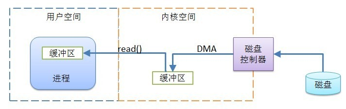
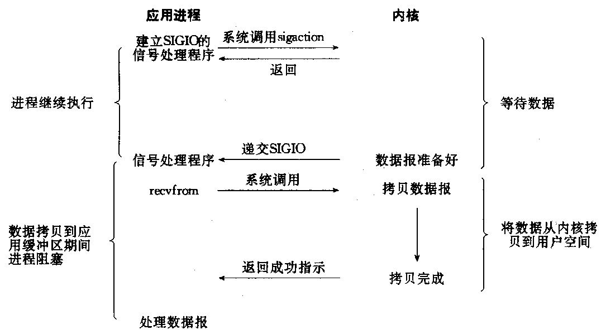
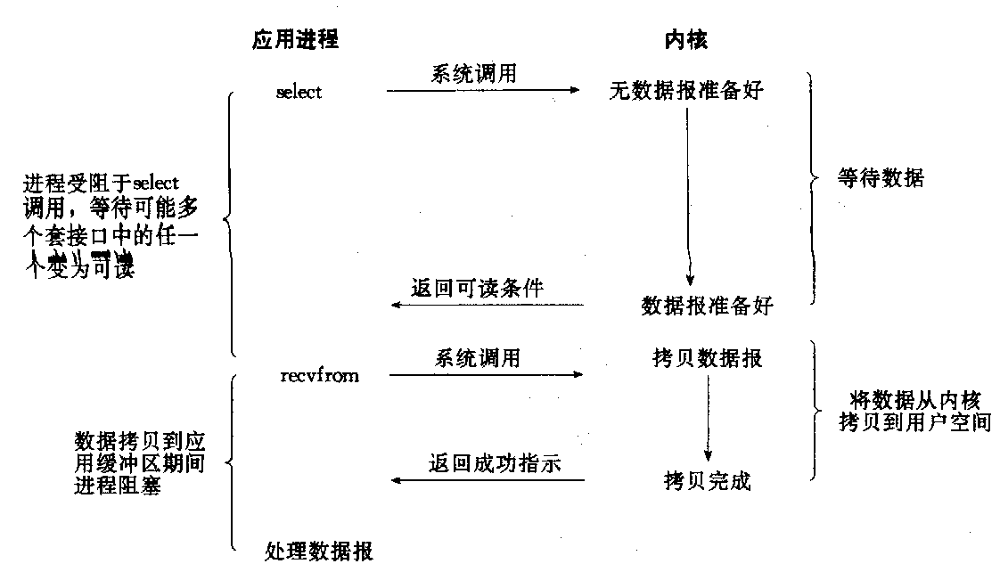
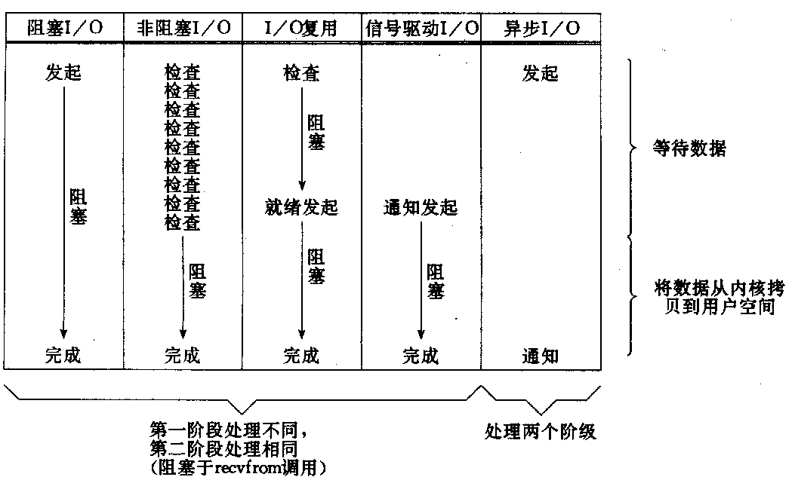

# IO 模型

---

## 1. IO 过程

**用户空间**：用户进程所在区域，如 JVM，该区域的代码不能直接访问硬件设备

**用户空间缓冲区**：Java 的 IO 进程读写数据的速度比直接访问虚拟机内存慢几个数量级，所以在执行一次 IO 时，预读取大量数据，缓存在虚拟机内存中

**内核空间**：操作系统所在区域，能与设备通讯，所有 IO 操作都直接或间接地通过内核空间

**内核空间缓冲区**：内核代码读写数据要通过磁盘的 IO 操作，由于磁盘 IO 操作的速度比直接访问内存慢了几个数量级，所以内核会对数据进行高速缓存或预读取到内核空间的缓冲区，以便减少磁盘 IO，提高性能

当用户线程进行 IO 操作时，会执行一个系统调用将控制权移交给内核，内核负责找到请求的数据，并将数据传送到用户空间内的指定缓冲区。整个 IO 过程可以分为两个阶段：

1. 用户线程发起 IO 请求，等待数据准备就绪
2. 将数据拷贝到用户空间

IO 操作需要的 CPU 资源相对较少，大部分工作分派给 DMA 完成。如我们所知，**进程或线程快速切换来达到并发的效果，这个效果是在存在 CPU 以外的其他设备时才能显示出其意义**，就像计算机硬件上使用 DMA 来进行磁盘访问，也就是说发出请求后 CPU 就不再或很少耗费时间管理 IO 操作，让出的时间可以处理其他程序，直到 DMA 完成在通过中断通知 CPU，所以一个 IO 操作占用的 CPU 资源较少。正是这种机制的存在，才使得并发这种「伪并行」也具有十分重要的意义。

虽说 IO 操作不会占据大量的 CPU 时间，但是频繁的 IO 仍是十分耗费资源的，所以需要各种 IO 模型来缓解 IO 压力。

## 2. IO 类型

阻塞：调用者在发出请求后一直处于等待状态，直到被调用者返回
非阻塞：调用者在发出请求后不用等待被调用者返回，继续向下执行
同步：被调用者处理完之前不会通知调用者，只有处理完才会发出通知
异步：被调用者在接到请求后先通知调用者已经接收到请求，然后进行处理，处理完毕通过回调等方式通知调用者

阻塞和非阻塞最大的区别是在被调用方返回之前**调用方的行为**，同步和异步最大的区别是**被调用方返回的时机**。对应 IO过程的两个步骤：

* **阻塞与非阻塞的区别在第一阶段**，也就是说阻塞时用户线程发起 IO 请求后需要一直等待数据准备的行为给出一个结果，而非阻塞则会直接返回给用户线程一个结果，使得用户线程不需要等待
* **同步与异步的区别在第二阶段**，也就是说同步操作时数据拷贝的动作需要由用户线程完成，而异步则是由系统内核执行

## 3. Unix IO 模型

recvfrom 函数类似于标准的 read 函数，它的作用是从指定的套接字中读取数据报。recvfrom 会从应用进程空间运行切换到内核空间中运行，一段时间后会再切换回来。

### 3.1 阻塞 IO

可以看到用户进程在发出系统调用后需要一直等待，直到数据准备完成后再将数据拷贝至用户空间，导致在 IO 的两个阶段中用户进程都被阻塞在了 IO 的处理上。

### 3.2 非阻塞 IO

与阻塞 IO 不同的是，在用户进程发起 IO 请求后，内核在数据准备完成之前会先返回一个结果，使得用户进程不会被阻塞住，能够执行其他任务。但是在这种非阻塞模型中，用户进程将非阻塞省下的 CPU 时间用于对数据准备状态的轮询，反而浪费了大量的 CPU 资源。

这种方式**对于单个 IO 意义不大，却为多路复用 IO 提供了条件**。

### 3.3 信号驱动 IO

信号驱动 IO 相比于非阻塞 IO ，不再使用轮询的方式查看数据是否准备就绪，而是用户进程事先在内核注册一个信号处理函数，当数据准备完毕时内核会通知用户进程，此时用户进程才进行数据拷贝工作。

### 3.4 多路复用 IO

多路复用 IO 使用到了 select 函数，这个函数会阻塞住线程，但是和阻塞 IO 不同的是：

* 用户将需要进行 IO 的 socket 注册到 select 中
* select 会借助一个线程使用非阻塞 IO 中轮询的方式监视多个注册的 socket，直到有 socket 变为可读再真正调用 recvfrom

#### 3.4.1 多路复用器

文件描述符（fd）：Socket 在 Linux 中是以文件的形式存在的，对于文件的读写就绪要通过文件描述符来进行。每一个进程都有一个数据结构 task_struct，里面指向一个文件描述符数组，来列出这个进程打开的所有文件的文件描述符。文件描述符是一个整数，是这个数组的下标。

**select**：**使用 1024 长度的数组 fd_set 保存 fd**，每次调用时需要把 fd_set 拷贝至内核。select 函数会监听文件描述符集合是否有变化，一旦有变化，就会**对 fd_set 进行遍历**，将发生变化的文件描述符在 fd_set 对应的位都设为 1，表示 Socket 可读或者可写，从而可以进行读写操作，然后再调用 select，进行下一轮的监听

**poll**：与 select 类似，不同的是改为使用链表的方式维护 fd，**不再有大小限制**

**epoll**：事先注册 fd，当某个 IO 就绪时，内核会采用回调的方式将这个 fd 加入到一个链表中管理，调用 epoll 便能得这个 fd，**省去了遍历的过程**

#### 3.4.2 多路复用 IO 的意义

就图示的同步阻塞 IO 和多路复用 IO 来看，多路复用 IO 似乎并没有多少优势，还额外增加了一个 select 调用，但优势在于仅使用一个线程就实现了对所有的 IO 请求的处理，同步阻塞 IO 必须使用多线程才能达到同样的方式。

而多路复用 IO 之所以能够使用一个线程管理所有 IO 请求，是因为多路复用 IO **将连接的可读可写事件与读写行为进行了分离**。

### 3.5 异步 IO

应用程序只发起请求，并立即收到一个返回，当收到通知时直接使用数据即可，因为内核已经在数据准备完毕后将数据拷贝至用户空间了

### 3.6 对比

前四种 IO 模型均为同步式 IO，因为在拷贝数据阶段都需要用户进程主动完成，在这个过程中进程被阻塞，无法执行其他任务。
