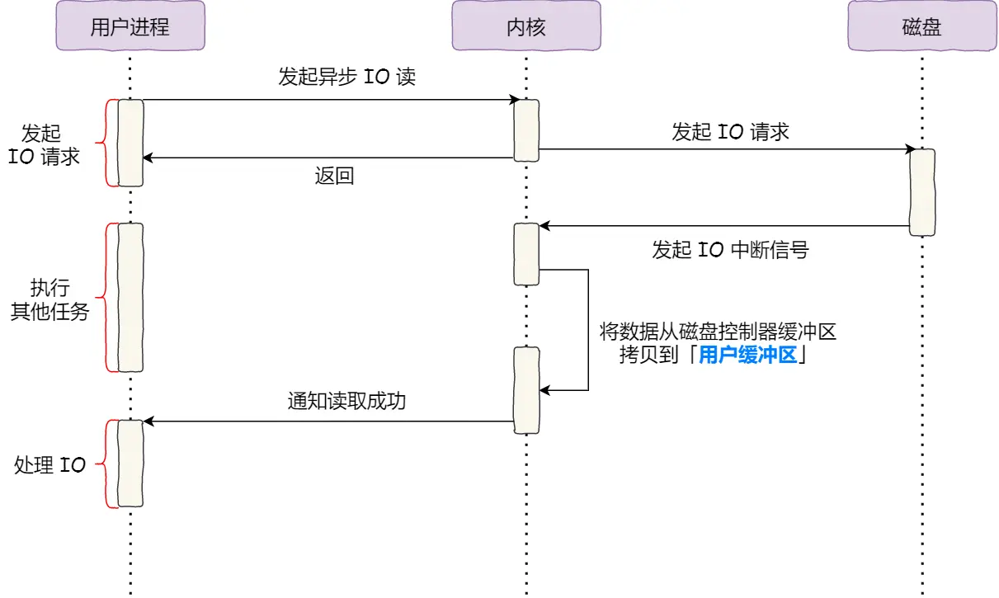

# 文件系统概览

* 虚拟文件系统：屏蔽不同文件系统的差异，对用户提供统一接口
* 文件系统：将 OS 按数据块（Linux 下为 4KB）读写磁盘数据和用户按字节读写文件数据对应进行映射

# 文件 I/O

## 缓冲与非缓冲

文件操作的库可以实现数据的缓存，根据**是否利用库的缓存功能**：

* 缓冲 I/O：通过文件库的缓存加速文件读写，而文件库再通过系统调用访问文件
* 非缓冲 I/O：直接通过系统调用访问文件

作用：减少系统调用（上下文切换）

## 直接与非直接

Linux 为了减少磁盘 I/O 次数，在内核中实现了数据缓冲区，根据**是否利用 OS 的缓存功能**：

* 直接 I/O：直接通过文件系统访问磁盘，不会发生内核缓存与用户程序之间的数据复制
* 非直接 I/O：读时数据从内核缓存复制到用户程序，写时数据从用户程序复制到内核缓存，由内核决定数据写入磁盘的时机

作用：减少一次数据从内核缓冲到用户程序的复制，但像 MySQL 这种程序，则使用直接 I/O，因为自己实现了更合适的缓存机制

## 阻塞与非阻塞

阻塞 I/O：阻塞的是**等待内核缓存准备数据**和**将内核缓存数据复制到用户程序**这两个阶段

非阻塞 I/O：相比阻塞 I/O，只在**将内核缓存数据复制到用户程序**阶段发生了阻塞，没有被阻塞在等待内核准备数据的阶段，但代替这种等待的是需要用户程序轮询内核查看数据是否已 ready

## 同步与异步

上述的阻塞与非阻塞 I/O 都是同步 I/O，因为在将数据从内核缓存复制到用户程序的这个过程中，用户进程都是需要等待的，真正的异步调用，两个阶段是都不需要等待的

# Page Cache

page cache 就是非直接 I/O 使用的数据缓冲区，本质上是 Linux 内核管理的一块内存区域

## 数据一致性

* Read/Write Through：
	* 向用户层提供接口，应用程序可以主动调用来保证磁盘数据和缓存一致
	* 牺牲 I/O 吞吐量，提升数据一致性
* Write Back：
	* 内核线程周期性的将脏页刷新回磁盘
	* 提升 I/O 吞吐量

## Page Cache 的优缺点

优点：
* 加快数据访问，访问内存比磁盘快很多
* 减少 I/O 次数，可一次装载多个 page，而程序往往又符合局部性原理，可提高系统磁盘 I/O 吞吐量
缺点：
* 占用额外的物理内存空间，极端情况下会导致频繁的 swap 操作
* 对应用层没有提供很好的 API，导致一些应用在内存中实现自己的 page cache，如 MySQL
* 比直接 I/O 多一次磁盘交互

# 文件传输场景下的 IO 流程

## Direct Memory Access

无 DMA 参与和有 DMA 参与的 IO 过程如图

可以看到，在有了 DMA 控制器后，CPU 不再参与「将数据从磁盘复制到内核缓冲区」这一过程，极大地节省了 CPU 资源

> 如何理解 DMA
> 可以将 DMA 看作内核内存空间的一片区域，网卡驱动在 OS 中注册中断处理函数，网卡收到数据后将数据放入 DMA，数据传输完毕后触发中断，CPU 接收中断后执行网卡注册的中断函数，从 DMA 读取数据

## 小文件传输

### read + write

在这个过程中：
* read + write 共计进行了 4 次用户态和内核态的切换
* 磁盘、内核缓冲区及用户缓冲区之间发生了 4 次数据拷贝

### mmap + write

mmap 将 Page Cache 映射到用户进程的虚拟内存地址上，使得用户进程和内核共享一部分内存区域，通过缺页中断发起真正的磁盘 I/O，相比 read 减少一次数据拷贝

### sendfile

sendfile 可以代替 read + write，直接将内核缓冲区中 A 处的数据拷贝至 B 处，相比 mmap + write，减少一次用户态和内核态的切换

### the Scatter-Gather DMA

在网卡支持 SG-DMA 的情况下，网卡的 DMA 控制器可以直接将数据从内核缓冲区拷贝至网卡

### Zero-Copy

不发生内存层面的数据拷贝，CPU 不参与数据拷贝的过程

## 大文件传输

使用 ZC 传输大文件的问题：

* 大文件会占用过多的 Page Cache 空间，其他热点文件数据无法利用缓存，导致磁盘整体读写性能下降
* 大文件数据过多，难以命中 Page Cache

异步 I/O + 直接 I/O 传输大文件可以实现大文件的非阻塞读取
* 异步 I/O：解决大文件数据大、阻塞时间长的问题
* 直接 I/O：不使用 Page Cache

