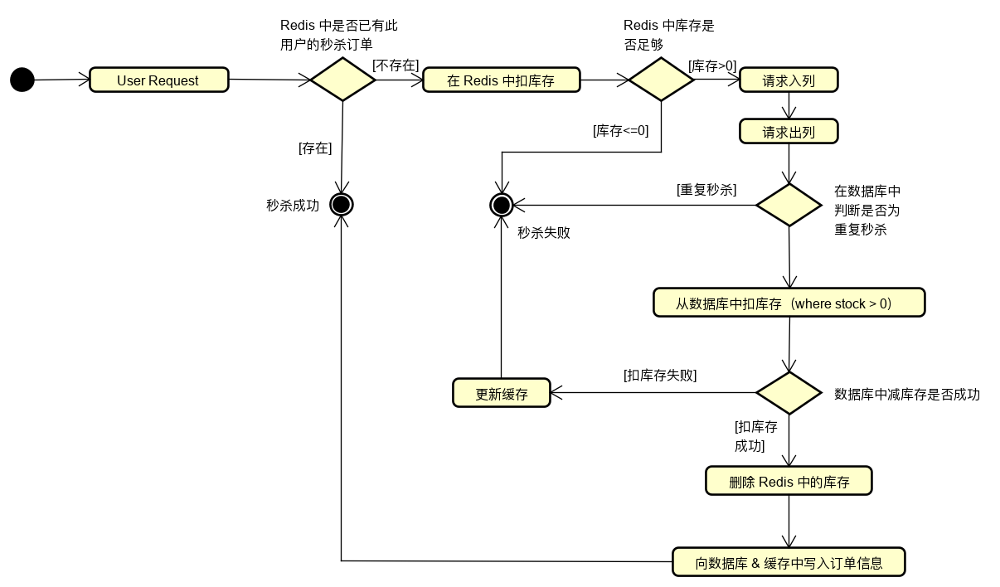

# 场景设计

---

## 1. 秒杀

### 1.1 前端

秒杀时前端主要是対用户的请求频率进行一定的限制：

* 限制两次点击之间的间隔时间

### 1.2 接口

在后端接口上需要进行限流：

* 固定时间窗口限流：在固定时间内控制访问次数。将访问路径与用户 id 作为 key 存入 Redis 中，key 设置有效期，value 为访问次数
* 滑动时间窗口限流：
  * 固定时间窗口限流过于粗略，无法应对两个时间窗口临界间的突发流量：假设访问限制是 100次 / 秒，前一个窗口内 100 个请求集中在后 10ms，后一个窗口内 100 个请求集中在前 10ms 内，则 20ms 内出现了 200 次请求
  * 滑动时间窗口能够限制住任意固定时间间隔内的请求次数：使用一个循环队列存放请求，队列的大小为 1s 内允许的请求次数；每当请求到来时删除与这个新请求间隔 1s 的旧请求；如果队列中无空位存放新来的请求，则阻塞
* 使用一些现成的限流算法：如令牌桶

### 1.3 缓存预热

需要提前将秒杀业务的相关数据加载到 Redis 中，否则服务刚启动时 Redis 中没有数据，请求会压垮数据库。

* 单机下如数据量不大时可以在系统启动时加载，或使用定时器刷新，或由用户触发

### 1.4 秒杀与并发

秒杀业务在代码层面就是一个方法，可以是库存减 1 的操作，也可以是其他逻辑，这个操作是需要访问数据库的，这时数据库就是共享资源，而多线程访问共享资源需要同步，否则会出现并发问题，反映到秒杀业务中典型的就是库存扣超了。而同步的方法不假思索可以想到：

* 数据库层面的锁
* 简单粗暴的 synchronized
* 基于 CAS 的非阻塞锁
* 借助队列进行串行化

上述方法其实都多少存在一些问题，实际中如果秒杀的不是同一个商品，那么并发应该是允许的，可以不用同步，但是以上的方法并没有解决这个问题。

说白了就是想进一步将锁控制在更细的粒度上：给每个商品都设置一把互斥锁，这样就可以增加不同商品被秒杀时的并发度，不会导致所有线程都互斥，而[分布式锁](../distribution/distribution.md#lock)恰好可以实现这种需求。

### 1.5 后端流程

需要注意的问题：

* 为什么从队列消费消息时还需要判断重复秒杀？
  * 因为由于网络传输故障等，无法百分百保证消息不被重复消费，所以可以在数据库中 insert 的表中使用唯一索引，来避免重复消费消息带来的问题
  * 项目中也是基于这个原因而单独建立秒杀订单表
  * 当采用多线程进行消息消费时，可以考虑先在 Redis 中判断重复秒杀
* 关于扣库存操作：
  * 项目中简单地在数据库层面（扣库存时需要判断 stock > 0）进行判断，因为只有单线程消费消息
  * 在多线程消费消息或不使用消息队列的情况下，需要対扣库存操作进行同步，也就是上文说的秒杀问题，数据库的行锁出现瓶颈，需要在代码层面加锁或使用乐观锁（减库存时需要先读库存，然后减操作时判断当前库存是否与读到的库存一致，也就是 CAS）
* 关于缓存更新：
  * 如图所示，因为是单线程情况，所以更新库存缓存时其实直接更新即可，没有太多需要注意的问题
  * 在多线程情况下如果按照「先更新数据库再更令缓存失效」的策略，就会出现缓存击穿的问题，需要使用双缓存（可能发生数据不一致，也就是 CAP 中牺牲了 C）或分布式锁
* 关于前端处理：
  * 由于借助了消息队列，秒杀变成了异步下单，请求入列后直接返回「排队中」
  * 前端轮询 Redis 中的秒杀订单信息，分为「排队中 / 秒杀失败 / 秒杀成功」
* 关于秒杀成功
  * 扣库存和生成订单信息均成功才说明秒杀成功，具有原子性，需要用事务包裹

### 1.6 一些扩展

* 关于获取秒杀结果：
  * 异步下单并通过前端轮询的方式来获取结果，很类似非阻塞 IO，直到获取到秒杀失败或秒杀成功才结束轮询，对于客户端来说用户体验并不好
  * **可以考虑使用服务单主动推送的方式，这样可以解除客户端轮询的限制，用户可以进行其他操作，也就是类似于异步 IO，而服务端异步通知则需要借助 WebSocket 来实现**
  * 如果采用同步的方式，也就是[多线程同时写 Redis](../distribution/distribution.md#concurrentWriteCache)，需要借助分布式锁，然后将秒杀成功的相关信息异步地写入数据库
* 关于秒杀人数限制：
  * 可以根据秒杀商品数给队列设置大小，队列满则认为后续请求均秒杀失败
  * 既然限制了请求数，那么需要考虑是否需要保证放过去的用户能够秒杀完商品，所以需要过滤掉重复的用户请求，可以借助 Redis 的 set 存储相关信息，set 大小为队列大小，来判断重复的用户请求
* 关于查看秒杀状态
  * 对于秒杀来说某个时间点上库存剩余量意义不大，用户更关心的是能够秒杀，也就是 true or false 的问题，这个值在秒杀期间是比较稳定的，在库存耗尽时更新即可

## 2. 短网址

### 2.1 原理

当访问短网址时：

1. 访问短网址服务，查询短码
2. 短网址服务器获取原网址
3. 请求通过 301 重定向到原网址

> 301 是永久重定向，而 302 是临时重定向，如网址的短期变化，而短网址一旦生成就不会变化，使用 301 是符合 HTTP 语义的。

### 2.2 网址转换

短网址服务的核心是将原网址通过某种方式转换成短网址，并且短网址和原网址是一一对应的。当生成短网址后分为两步：

1. 首先查询短网址是否有重复，如果不重复则直接返回给用户使用
2. 如果重复，则查看对应的原始网址与当前处理的是否相同，如果相同则说明已经有人请求过当前原网址的短网址，那么直接返回这个短网址即可。否则就发生了冲突

上述过程实际和数据库交互了两次：

1. 在现有映射中查找生成的短网址是否重复
2. 将新的映射进行存储

可以通过给短网址字段建立唯一索引的方式将上述过程压缩到一条 SQL 语句，或者使用布隆过滤器查找生成的短网址是否有重复。

### 2.3 转换方式

这种需要建立一一对应关系的场景可以考虑 hash 算法。

算法选择：通过 hash 算法将原网址转换成一个固定长度的序列。虽然存在 MD5、SHA 这些算法，但这里使用的更注重于计算速度和冲突概率，广泛使用的是 MurmurHash 算法。

长度优化：将 10 进制的 hash 串转换为 62 进制的序列，能够有效缩短短网址的长度。

解决 hash 冲突：

* 一般会将原网址和短网址的对应关系进行存储，但是当发生 hash 冲突时，就会发生同一个短网址对应一个以上原网址的情况
* 当发生冲突时可以给原网址拼接固定字符串，然后重新计算 hash 值，如果仍然重复，则可以更换拼接的字符串
* 存储时也是将拼接字符串后的原网址存入，返回时去除拼接字符串即可

另外，使用 [ID 生成器](../distribution/distribution.md#id_generator)来代替 hash 算法也是可行的。

### 2.4 一些扩展

* 关于自定义短网址的短码：
  * 可以抽象出「自定义短码-短网址」和「短网址-原网址」这两层关系。对于第一种映射类似于注册用户，用户名不可重复，使用唯一索引判重
