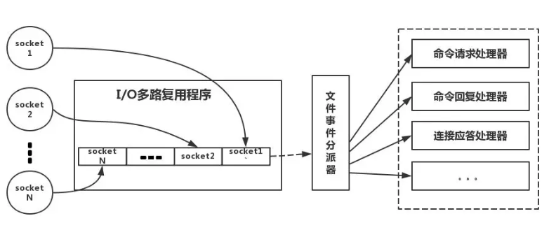

## 基本数据类型

### String

由 SDS 实现，底层包括一个 char[]、已使用的长度、未使用长度
* 便于内存分配
* O(1) 获取字符串长度

### List

由 quicklist 实现，包含双向链表和压缩列表

### Hash

类似 HashMap

#### 渐进式 rehash

* 底层有两个 hash 表，只向其中一个写入
* 元素达到阈值时将另一个 hash 表扩容一倍，随着每次增删改查逐个 rehash 每个 hash 桶内的元素
* rehash 完毕后指向扩容完毕的 hash 表
* rehash 过程中
	* 查询时先查旧的，查不到再查新的
	* 直接向新表写入

### Set

同 Hash

### ZSet

由 dict + skiplist 实现
* dict 维护 ele 和 score 的映射
* skiplist 维护了根据 score 有序的 ele 序列

> 为什么选择 skiplist
> * 跳表实现更简单
> * 单节点平均指针数比平衡树的更少，更节省内存
> * 动态性能更好，增删时不需要考虑平衡性、节点合并、分裂等

## 线程模型

Redis 使用的是单线程工作模型：

* 纯内存操作
* 单线程避免了上下文切换
* 多路复用 IO

> * 需要注意的是，这里的单线程指的是每次请求的处理，也就是命令的执行是单线程的，但是 redis 是有后台线程的
> * 在 6.0 后对网络请求的处理引入了多线程

## 过期策略 & 淘汰策略

### 过期策略

* 定期删除：占用 CPU 资源
* 惰性删除：可能导致过期的 key 始终占用内存资源

### 淘汰策略

* noeviction：内存不足时写入数据报错
* allkeys-lru：删除最近最少使用的 key
* allkeys-random：随机删除某个 key
* volatile-lru：在设置了过期时间的 key 中删除最近最少使用的
* volatile-random：在设置了过期时间的 key 中随机删除一个
* volatile-ttl：在设置了过期时间的 key 中删除将要过期的

## 持久化

### AOF

每执行一条写操作命令就将其追加到文件里
* 优点：写文件的方式可以细粒度控制刷盘策略
* 缺点：文件可能会很大，导致恢复时会很慢，需要定期重写
* 场景：redis 用作 db，不能丢数据

### RDB

主进程 fork 出子进程将内存数据序列化保存
* 优点：文件小，恢复快
* 缺点：基于 COW 机制，会丢数据
* 场景：redis 用作 cache，需要恢复快，尽量不让请求直接打到 db

### 混合持久化

fork 出的子进程将内存快照数据以 RDB 方式写入 AOF 文件，同时主线程处理的写命令也写入 AOF 文件，持久化完毕后将同时有 RDB 和 AOF 数据的文件替换原本的 AOF 文件

## 缓存问题

### 缓存穿透

故意请求 db 中不存在的数据，缓存永远无法命中，导致所有请求涌向数据库
* 缓存空值：将不存在的数据缓存为空值，并设置一个很短的有效期，防止占用空间，但如果有效期内这些 key 的数据被写入数据库，则会导致不一致问题
* 布隆过滤器：使用所有的 key 建立一个 Bloom Filter，从而快速判断请求的 key 是否合法
	* 过滤器删除的问题可以参考布谷鸟过滤器

### 缓存雪崩

缓存设置了相同的过期，同一时间缓存大面积失效
* 随机值：给失效时间加一个随机值，避免集体失效
	* 业务上有定点更新数据的场景，此时必须要让缓存失效，那么可以在服务中进行查询时再增加一个随机的延迟时间

### 缓存击穿

热点数据过期，导致大量请求涌向数据库
* 异步续期：比较固定的数据，可以提前进行续期操作
* 加锁（数据并发竞争）

### 数据并发竞争

Redis 是单线程模型，不存在并发问题，但是业务中会出现多个线程或多个 redis client 写同一个 key 的情况，此时就需要进行同步操作：

* 加锁
	* 抢不到锁的线程可以 sleep 或自旋一会儿后再次抢锁
* 将数据写入消息队列，由单线程更新缓存
* cas：set 时同时设置时间戳，那么后抢到锁的子系统如果发现自己的时间戳早于缓存中存在的，就不再进行 set 操作，因为此时缓存中值已经比自己持有的值新

后两种方法可以在同步的同时按一定顺序写入

### 热 key

* 提前预测 or 实时收集
* 使用不同的后缀拆分至多分片
* 多节点备份，单节点故障后立刻切换

### 大 key

* 有选择的删除
* 合理设置过期时间
* 按一定规则拆分至多分片
* 专门的节点存储