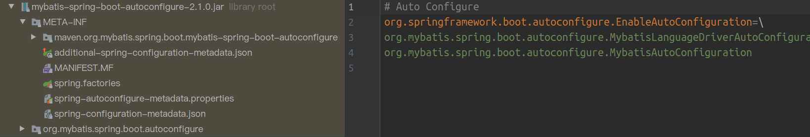
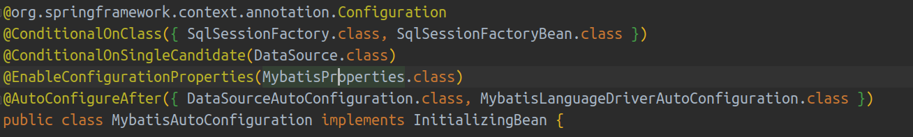
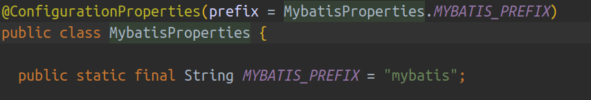

# Spring

---

## 1. Spring Boot 自动配置原理

### 1.1 组件导入方式

* 导入自己构建的组件：包扫描（@ComponentScan）+ 组件注解（@Controller / @Service / @Repository / @Component）

* 导入第三方组件：配置类（@Configuration）+ 声明 bean（@Bean）

* 快速导入组件到容器中：使用注解导入（@Import）

### 1.2 @Import

Import 注解的作用有两方面：

* 导入其他配置类，将多个配置类集成为一个统一的配置类
* 导入普通的 Java 类时，这个类会被声明为 bean

**与 ImportSelector 接口配合使用**：这个接口唯一的方法 selectImports() 会返回类全名的数组，导入这个接口的实现类，selectImports() 返回的数组中的各个类都会通过 @Import 被声明为 bean。

**与 ImportBeanDefinitionRegistrar 接口配合使用**：接口的 registerBeanDefinitions() 可以对 bean 进行一定程度的定制，再手动加载 bean。同 ImportSelector，需要和 @Configuration 和 @Import 配合使用。

### 1.3 自动配置过程

1. Spring Boot 应用需要使用 @SpringBootApplication 注解标注启动类，这个注解是组合注解，包含了 @EnableAutoConfiguration，它就是开启自动配置的核心注解
2. @EnableAutoConfiguration 通过 @Import 导入了 AutoConfigurationImportSelector 类，类中重写了 selectImports()，用于返回需要导入的全部类，获取全部类全名的调用链如下：

    > getAutoConfigurationEntry() -> getCandidateConfigurations() -> loadFactoryNames()

3. 调用 loadFactoryNames() 时传入了 EnableAutoConfiguration.class 作为参数

    ```java
    public static List<String> loadFactoryNames(Class<?> factoryClass, @Nullable ClassLoader classLoader) {
            String factoryClassName = factoryClass.getName();
            return loadSpringFactories(classLoader).getOrDefault(factoryClassName, Collections.emptyList());
        }
    ```

    可以看到传入的 EnableAutoConfiguration.class 就是 factoryClass，方法中获取到类名用于后续调用

4. loadSpringFactories() 中就是获取需要配置的类权限定名的具体逻辑：通过读取 classpath（这里的 classpath 包括所有的第三方 jar 包的 classpath，因为引入的每个 starter 中都会包含一个 spring.factories 文件） 下的 spring.factories 文件，将其中的信息封装为 Map 对象并返回

    

    图中所示为引入 mybatis-spring-boot-starter 后，autoconfigure 包中的 spring.factories 文件，其 key 为 EnableAutoConfiguration

5. loadFactoryNames() 得到返回的 Map 对象后，调用 Map 的 getOrDefault()，获取到 key 为 EnableAutoConfiguration 的 value
6. 最终这些在配置文件中被声明的类都会通过 @Import 被导入到住配置类中 从而被声明为 bean。需要注意的是，**这些被加载的类只是各个 starter 中的自动配置类，这些自动配置类会根据条件进行具体的 bean 的加载以及配置文件属性的读取**

### 1.4 自动配置类

由于 Spring 会加载所有 starter 的自动配置类，所以各个 starter 的自动配置类会使用 @CondtitonalXXX 注解进行标注，在满足特定条件下才启用配置类。

在引入 starter 的同时，常常会在 application.properties 中进行特定属性的配置，这些配置也是通过对应 stater 中自动配置类来读取的。



图示为 mybatis starter 中的自动配置类，其中 @EnableConfigurationProperties(MybatisProperties.class) 是读取配置文件的核心注解，它会将配置对应的属性类和配置文件关联，并把属性类加入容器中。



可以看到 mybatis stater 在 properties 类中指定了配置属性时的前缀：mybatis，spring 会根据属性将配置文件中的值映射到这个类中的属性上。

## 2. Spring 中的线程安全

**Spring 没有为它的 bean 保证并发安全**。

singleton：

* 如果 bean 被声明为单例，则容器中只会实例化出一个 bean，所有的请求都使用这个 bean
* 这个 bean 保存在一个 Map 中，每次请求来的时候都会先在 Map 中查找
* 生命周期和容器相同

prototype：

* 每次请求到达需要使用 bean 时都是重新实例化，不会在 Map 中进行查找

我们交给 Spring 管理的 bean 大多是一些无状态的对象 (可以理解为没有成员变量，仅仅是用于进行一些操作和处理)，不会因为多线程导致状态改变，所以很适合使用默认的单例 scope，如 Controller、Service、Dao 等。但是对于有状态的 bean，虽然使用 prototype 可以避免发生多线程操作共享资源的情况，但是频繁地创建对象会影响性能。所以这种情况下 Spring 借助 ThreadLocal 来将 bean 变为线程私有，为每个线程创建了一个单例 bean 的副本，解决了并发冲突。

## 3. Spring AOP 的原理

1. bean 初始化过程中有一个 applyBeanPostProcessorsAfterInitialization 阶段，这个阶段中会获取所有实现了 BeanPostProcessor 接口的类，并调用这个接口的 postProcessAfterInitialization()
2. 这些 BPP 中存在一个专门为 AOP 服务的类：AbstractAutoProxyCreator，它实现的 postProcessAfterInitialization() 会调用 getAdvicesAndAdvisorsForBean() 去获取 Advice 和 Advisor 列表，然后调用 createProxy() 利用它们创建代理对象
3. 将创建好的代理对象注入 IoC 容器即可

## 4. Spring 事务

@Transactional 只会回滚运行时异常，并**不会回滚编译时异常**

### 4.1 事务的实现

* Spring 的事务是基于 Spring 的 AOP 机制
* Spring 中存在专门提供事务服务的 Advisor、Advice、PointCut，典型的如事务的 PointCut 就是 TransactionAttributeSourcePointcut，它用来检测方法上有没有 @Transactional
* 根据 Spring AOP 的实现，事务切面的逻辑就会被织入相应的对象

### 4.2 事务配置

* （no）rollbackFor：指定在特定异常出现时（不）回滚
* propagation：传播级别
* isolation：隔离级别

### 4.3 事务的传播级别

**前提**：在 A 中调用一个被 @Transactional 修饰的方法 B 时，被调用的方法 B 需要注意事务传播级别的配置。需要注意的是 A 方法并不一定也需要声明事务。

|传播级别（B）|是否支持外层事务（A）|说明|
|---|---|---|
|REQUIRED（默认）|支持|如果 A 开启事务，则 AB 处于同一个事务中，AB 中任意一个回滚都会导致另一个也会滚；否则 B 开启独立事务，不影响外部事务和其他平级的事务|
|SUPPORTS|支持|如果 A 开启事务，则 B 使用 A 的事务；否则 B 也不会开启事务|
|MANDATORY|支持|如果 A 开启事务，则 B 使用 A 的事务；否则调用 B 会抛出异常|
|NESTED|支持|如果 A 开启事务，则 A 回滚也使 B 回滚，并且 B 可以单独回滚而不影响外部事务和其他平级事务；否则同 REQUIRED|
|REQUIRED_NEW|不支持|不论 A 是否开启事务，B 都可以单独回滚而不影响外部事务和其他平级事务|
|NEVER|不支持|如果 A 开始事务，则抛出异常|
|NOT_SUPPORTED|不支持|即使 A 开启事务，B 也不使用事务|

需要注意的：

* REQUIERD_NEW：A 回滚时不会回滚掉 B 的操作，也就是说 B 会新开一个独立的事务。适用于记录操作：
  
  ```java
  @Transactional
  save(){
      ...
      logOperation();
      ...
      // 此处出现异常不会导致 logOperation() 回滚
  }
  ------
  @Transactional(propagation = Propagation.REQUIERD_NEW)
  logOperation(){}
  ```

* NESTED：相比于 REQUIERD_NEW 必须新开事务，NESTED 下如果外层事务存在，则不会新开事务，而是利用 savepoint 回滚。适用于批量操作：

  ```java
  @Transactional
  patchOperate(){
      ...
      for(){
          try{
              operate();
          }catch(e){
              logFailed();
          }
      }
      ...
  }
  ------
  @Transactional(propagation = Propagation.NESTED)
  operation(){}
  ```

  在这个批量操作中进行了异常捕获，以便在某次操作失败时进行记录从而进行重试，保证批量操作的完整性。如果使用 REQUIRD，抛出的异常被捕获，失败单次操作不会回滚；如果使用 REQUIRED_NEW，虽然会回滚，但是新开事务会影响性能。此时使用 NESTED 就较为合适：单次操作回滚，异常被捕获。而且没有新开事务
* 关于 savepoint：就像一个指针，指向事务 log 的某个位置，当需要回滚时，只需回滚到对应 log 的位置即可。使用 savepoint 时，不需要新建连接、也不需要执行事务提交、释放锁等复杂耗时的操作，所以 NESTED 比每次都创建事务的 REQUIRED_NEW 更快

### 4.4 事务消失

**如果在同一个类中用没有事务注解的方法调用有事务注解的方法，不会触发事务**。

```java
public void test1(){
    ...
    test2();
    ...
}
------
@Transactional
public void test2(){
    // do something
}
```

如果在类或方法上标注 @Transactional，Spring 都会生成这个对象的代理对象：

* 如果直接调用有事务注解的 test2()，那么代理对象会执行织入事务后的方法
* 如果调用没有事务注解的 test1()，此时代理对象的 test1() 中对 test2() 的调用会被直接转发到被代理对象上，而被代理对象中的 test2() 并不存在事务

    ```java
    // 代理对象
    public void test1(){
        ...
        // target 为被代理对象
        target.test2();
        ...
    }
    ```
