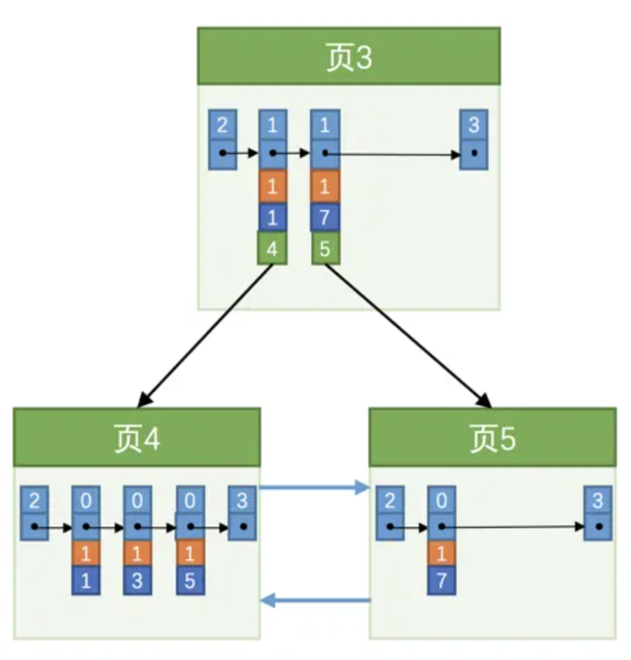

以下均基于 InnoDB

## 一级索引

复用了数据页的存储结构，但是原本数据页中每行的列值变成了页号和该页的最小主键值，这种页称为索引页
* 多层结构
* 也存有上一页页号和下一页页号，即每层的索引页间也组成了双向链表
* 数据按照主键顺序进行物理存储

## 二级索引

和聚簇索引不同的是，二级索引的索引页中的每条记录除了有页号和该页最小索引列值，还有该页最小主键，否则当某索引页中多条记录所记录的索引列值相同时，则无法进一步定位下一页的页号
* 二级索引叶子结点上索引列列相同的值是按照主键排序的
* 叶子节点的数据按照索引顺序进行物理存储


## explain

### ref

* const：主键索引、唯一索引的等值匹配
* ref：非唯一索引（普通二级索引）的等值匹配
* range：索引（一级、二级）范围查询
* index：覆盖索引但需要全索引扫描
* all：全表扫描
* index_merge：索引合并

### extra

* using where：使用 where 子句进行了过滤
* using index：覆盖索引
* using index condition：索引下推
* using filesort：没有使用索引排序而是文件排序

## 范围查询

例：c1 & c2 为联合索引

```sql
c1 > 'a' and c1 < 'd'
```

1. 通过二级索引找到第一条 c1 > 'a' 的记录，拿到主键并回表，将完整数据发给 client
2. 继续从二级索引刚才的位置，沿记录组成的链表向后查找下一条，直到不符合 c1 < 'd'

```sql
c1 > 'a' and c1 < 'd' and c2 > 'g'
```

1. 和上述查询类似，但再回表后 server 层需要在内存中根据其他 where 条件（ c2 > 'g'）进行过滤

> 索引下推
> * 在上述查询的过程中，在回表前再判断一下 c2 > 'g' 是否满足，如果不满足则直接找下一条，省去一次回表再判断的过程
> * 只用于二级索引

## 索引合并

其他查询中最多只会用到一个索引，但是特殊情况下可以走索引合并，一次查询中使用多个索引

### intersection 合并

```sql
SELECT * FROM single_table WHERE key1 = 'a' AND key2 = 'b';
```

其中 key1、key2 均为二级索引，可以分别找到各自二级索引中对应的主键，直接二者取交集即可，只需要回表一次，主要有两种 case：
* 必须全索引列等值匹配：只有全索引列等值匹配查出来的主键才是排序完毕的，对两个有序序列求交集的时间复杂度为 O(n)
* 主键列可以是范围匹配：因为从一级索引范围查询出的主键也是有序的

## 回表消耗

二级索引中查找数据为顺序 I/O，但是每次根据二级索引查到的主键在一级索引中查找数据则为随机 I/O，因为查出的主键不是有序的。所以当查找大量需要回表的数据时，可能放弃索引而采用全表扫描（扫描一级索引）